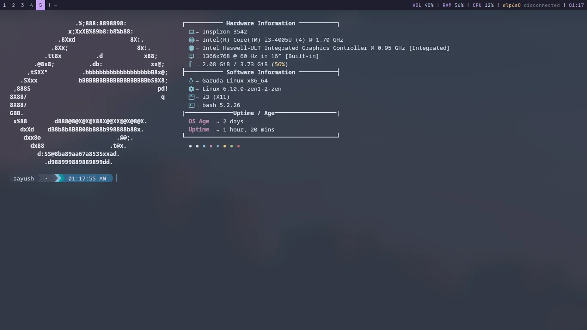
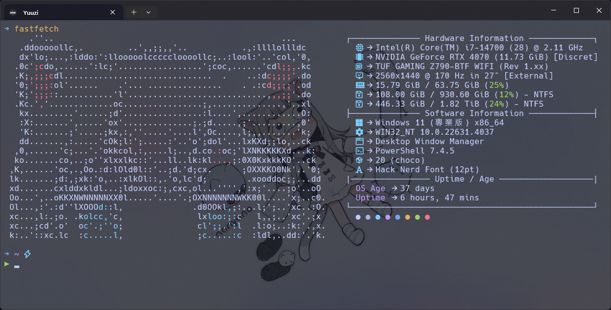

## 前言

雖然我上一篇才寫了一篇和Neofetch有關的文章，不過那其實是我以前寫然後搬來這裡的，最近跳槽到Fastfetch我覺得在Windows速度很可以啊，畢竟他是用C寫的，而Neofetch則是用bash實現的。這篇不會細講怎麼將ASCII藝術放入Fastfetch，老實說我也還沒玩得很明白，暫且是透過Python腳本把以前用jp2a轉換的ASCII藝術改寫成for Fastfetch的，總之廢話不多說進入正題。

## 安裝Fastfetch

安裝Fastfetch很簡單，從自己的OS選擇自己喜歡的方式，我簡單瀏覽過看起來方法並不少，Fastfetch的Repo位址👇

::github{repo="fastfetch-cli/fastfetch"}

## 設定config

接下來就要設定config了，畢竟原版配置說不上醜，就是不夠優雅，不夠個性對吧，這裡我找到了一個[由reddit用戶aayush-le寫好的配置](https://www.reddit.com/r/GarudaLinux/comments/1ecwz33/enhancing_fastfetch_elegance_a_new_config_update/)，我覺得挺好看的，總之先照著他說的做，我這裡簡單翻譯成中文好了

1. 先到當前使用者的`.config`資料夾裡面 → `/home/<your_username>/.config`，如果沒找到就自己創一個
2. 如果在`.config`資料夾裡面沒有看到`fastfetch`資料夾，那就自己創一個 → `mkdir fastfetch`
3. 透過fastfetch提供的指令創建一個預設的config文件 → `fastfetch --gen-config`
4. 移除預設的config文件 → `rm fastfetch/config.jsonc`
5. 下載這個作著提供的config文件 → `wget https://raw.githubusercontent.com/aayushx402/i3-CatDotfiles/main/fastfetch/config.jsonc`
6. 重新啟動你的終端機

這裡的指令都是for Linux的，當然Windows也有部分兼容這些指令，但像是`wget`windows是沒有的，可以試試`curl`，其實方式百百種啦總之能下載下來到對的位置就OK了！經過這些步驟基本上在終端機輸入`fastfetch`應該已經會有像是這樣的畫面了，借用原作者的圖，接下來就可以再依照自己的喜好客製化囉：

## 為Windows做一些修改

如果你和我一樣是Windows用戶，你會看到有一些些不對勁，第一眼就是作業系統那一欄是Linux的圖標，不過這也很正常，畢竟這些圖標都是硬編碼的，我們只要自己改就好了，以下是我做了一些修改後的簡單Demo：

雖然原作者第一欄我不知道為什麼Windows沒辦法顯示，也可能是我這裡的問題，畢竟只要沒有值就不會顯示。我主要修改了Linux的圖標為Windows的，然後添加了一些原本沒有的欄位，每個欄位不喜歡的話註解掉就可以了，再來就是修復了OS Age的欄位，因為那欄是用bash指令寫的，Powershell想當然而沒辦法跑，於是我改成了Powershell的指令，不過這個欄位畢竟是用指令跑的，多少會影響性能，如果很介意多等約1秒才能看到結果的話也可以自行移除，下面我就放上我修改的config文件供大家參考。

[📄文件連結](https://gist.github.com/Yuuzi261/7cea2f8fdd9a46e2b5651b1de44355ad)
