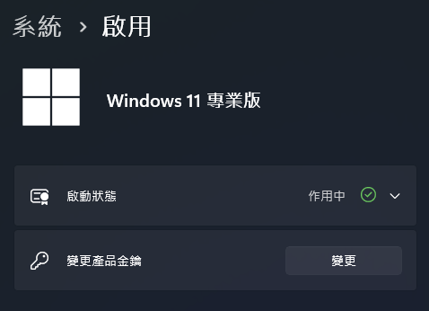

## 前言

在Github上看到開源的啟用Windows工具，趕緊打開虛擬機試試，去掉討人厭的浮水印，這也是為了日後教學截圖品質的考量（被打。對不起了微軟把拔，但連虛擬機也用正版的話有點負擔不起QwQ...

## 啟用Windows

這個工具關聯到了3個Github儲存庫，不過最有關係的應該就是下面這個，但其實也不太重要，主要是進到[這個網站](https://massgrave.dev/)照著教學走就對了，下面附上圖文教學。

::github{repo="massgravel/massgrave.dev"}

1. 打開`Powershell`，不是`CMD`要特別注意
2. 複製並貼上下面這行指令並執行
```bash
irm https://get.activated.win | iex
```
3. 接下來等它一下就會跳出這個介面

4. 選擇你要啟用的方式，按下對應的按鍵，我這裡就選擇第一個，出現下面這個畫面就是成功囉

5. 接下來按任何按鍵回到本來的頁面，之後按<kbd>5</kbd>確認一下啟用的狀態，確認啟用後按<kbd>0</kbd>關閉視窗
6. 重新啟動電腦應該就可以看到Windows已經啟用囉

