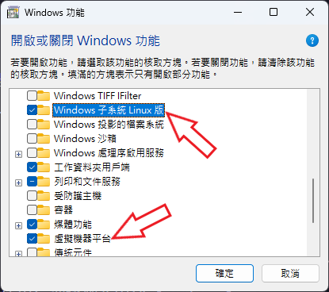
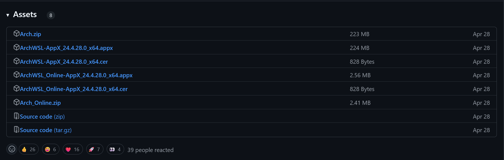
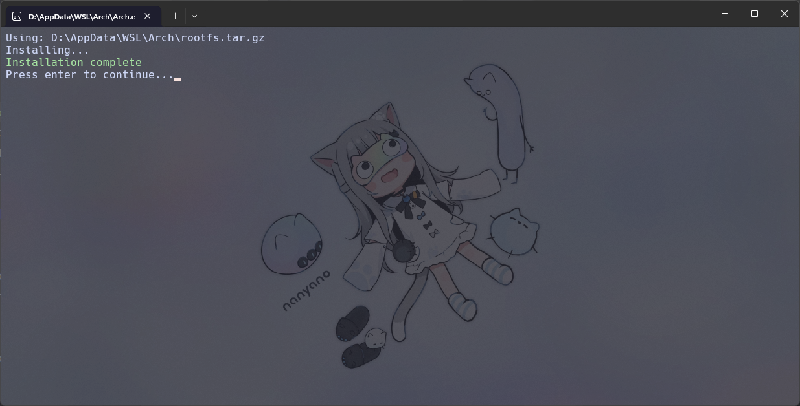
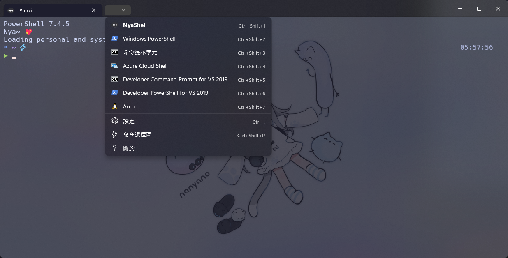

## 前言

因為 TensorFlow 這傢伙從 2.11 版本開始不支援 Windows 使用 GPU 了，想要在本地用到我整天風扇轉都不屑轉的 4070 果然還是得 WSL 啟動，不過為什麼是選擇 Arch Linux 呢？那當然是因為 Arch-chan 很可愛...我是說 Arch Linux 十分的香，你都點進來這個文章了怎麼會想問理由呢？


鎮樓圖，繪師：[Ravimo](https://www.pixiv.net/users/60562229)

## 啟用 Windows 功能

搜尋`Windows 功能`，進入`開啟或關閉 Windows 功能`介面，勾選`Windows 子系統 Linux 版`以及`虛擬機器平台`，按下確定後並重新啟動。



接下來打開 PowerShell，執行下面的指令，來確保 WSL 的組件是最新的：

```bash
wsl --update
```

因為 WSL 2 在安裝的過程中會遇到的問題比較少，所以這裡我們果然選擇使用 WSL 2，如果你想要使用 WSL 1，可以參考[文檔](https://wsldl-pg.github.io/ArchW-docs/How-to-Setup/)。

```bash
wsl --set-default-version 2
```

## 下載並安裝 ArchWSL

因為 Windows 沒有提供 Arch Linux 的 WSL 發行版本，所以這裡我們要用到 [ArchWSL](https://github.com/yuk7/ArchWSL) 這個項目，它可以幫我們少走很多條彎路。

::github{repo="yuk7/ArchWSL"}

進入[下載頁面](https://github.com/yuk7/ArchWSL/releases)選擇要下載的版本，這裡我直接選擇用第一個方法，也就是用 zip 安裝，這應該是步驟最簡單的方式。



接下來將載下來的 zip 檔案解壓縮到你要存放 WSL 的資料夾，像我這裡就是放在 `D:\AppData\WSL\Arch`。


:::important
資料夾的選擇上必須確保你有完整的訪問權限，不然會導致無法修改 `rootfs`，比如 `C:\Program Files` 就不可以用！
:::

接下來執行 `Arch.exe` 來安裝 Arch WSL！安裝成功的話會出現這個畫面，按下 `Enter` 鍵關閉視窗。



第一次安裝的話重新啟動 Windows Terminal 後通常就可以在選單找到我們剛剛安裝好的 ArchWSL 了，如果沒有自動新增的話也可以自己建立一份設定檔，我先稍微修改一下這個預設的設定檔，因為 Linux 的企鵝感覺不是這麼好看（Tux 愛好者：企鵝怎麼你了?



設定檔的指令可以參考下面，請根據你實際的路徑跟檔案名稱調整：

```bash
C:\Windows\system32\wsl.exe -d Arch
```

之後就可以直接透過下拉式選單打開 ArchWSL 了，進去之後要進行一些簡單的設定即可開始使用。

## 設定 ArchWSL

首先先在終端機打開 ArchWSL，可以看到一開始是 `root` 帳號，根據[最小權限原則](https://zh.wikipedia.org/wiki/%E6%9C%80%E5%B0%8F%E6%9D%83%E9%99%90%E5%8E%9F%E5%88%99)，我們需要創建一個帳號供日常使用，只有必要時才透過 `sudo` 指令提升權限。

1. 第一步先為 `root` 新增密碼：

```bash
passwd
```

2. 接下來建立 sudoers 文件:

```bash
echo "%wheel ALL=(ALL) ALL" > /etc/sudoers.d/wheel
```

3. 新增使用者

```bash
useradd -m -G wheel -s /bin/bash {username}
```

4. 為使用者建立密碼

```bash
passwd {username}
```

5. 關閉 ArchWSL，使用 powershell 進入到安裝 ArchWSL 的資料夾底下，執行下面的指令，將剛剛創建的使用者設為預設使用者

```bash
Arch.exe config --default-user {username}
```

如果出現報錯的話可以試試這個指令：

```bash
.\Arch.exe config --default-user {username}
```

:::info
如果預設使用者沒有成功變更，可以重新啟動電腦或參考[這裡](https://github.com/yuk7/ArchWSL/issues/7)。
:::

6. 再次打開 ArchWSL，並初始化金鑰環，要使用 Arch Linux 的套件管理工具 pacman 的話這是必須的

```bash
sudo pacman-key --init
```

```bash
sudo pacman-key --populate
```

```bash
sudo pacman -Sy archlinux-keyring
```

```bash
sudo pacman -Su
```

到這裡就完成最基本的安裝了，接下來就依照自己的個人需求安裝套件吧！

## 使用 systemctl（可選）

可以參考[文檔](https://wsldl-pg.github.io/ArchW-docs/How-to-Setup/)或是[微軟的 blog](https://devblogs.microsoft.com/commandline/systemd-support-is-now-available-in-wsl/)。
