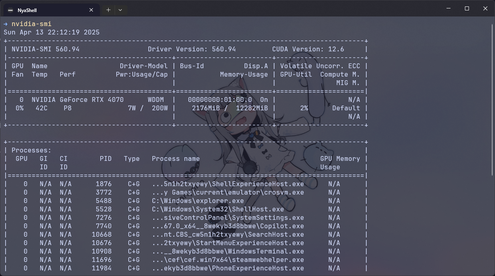

## 前言

最近有一些小小的需求需要對圖片進行去背，奈何我用一些常見的修圖工具修起來都不太理想，雖然應該是我技術問題，但我就不是相關科系的齁～身為一個資工系小白肯定是要發揮一下自己的專長，現代問題使用現代手段解決啊！！於是我就找到了這個非常多星星的U質專案：**Rembg**！他有提供 CPU 以及 GPU 版本的，既然有 GPU 版本的那當然沒道理不用對吧？事不宜遲，進教學！

::github{repo="danielgatis/rembg"}

## 安裝顯示卡驅動

因為每個人的作業系統不一樣，加上網路上各種作業系統安裝顯卡驅動的教學文章都已經很成熟了，這裡就不多做贅述。首先，透過指令確認是否已經安裝了顯卡驅動：

```bash
nvidia-smi
```



出現這個畫面就是安裝好驅動了，如果沒有安裝顯卡驅動就去先去安裝一下吧，要特別注意太舊的驅動可能不會支援比較新版本的 CUDA，雖然之後會用到 CUDA 跟 cuDNN 的套件看起來沒有太硬性規定 CUDA 的版本，但還是先注意一下！

## 安裝 Conda

我個人喜歡用虛擬環境，這樣可以很有效的獨立不同專案依賴的套件，Conda 是廣為人知的套件/環境管理系統，我們要透過他來管理不同專案要使用到的套件以及 CUDA、cuDNN 等等，方便在不同專案之間快速切換。

:::note
我這裡會使用 Miniconda，它比 Anaconda 更輕量，只需要安裝最小需求的套件：[Miniconda 文檔](https://docs.anaconda.com/miniconda/)。
:::

這一步和上一步類似，各種作業系統的教學也都很成熟了，官方的文檔也寫的蠻清楚的，這裡就不詳細說明。

## 創建 Conda 虛擬環境

安裝好 Conda 後，就可以創建虛擬環境了!

```bash
conda create -n rembg python=3.12.5
```

:::note
根據 [Rembg 官方文檔](https://github.com/danielgatis/rembg/blob/main/README.md)，Python版本應該 >= 3.10 並 < 3.14（隨著更新可能會改變，具體範圍請到文檔中確認）
:::

創建好環境後進入：

```bash
conda activate rembg
```

## 安裝 CUDA 以及 cuDNN

這點比較重要，也是很容易出事的地方，這兩個套件是要啟用 GPU 加速不可或缺的，並且版本不可以隨便，這兩者之間必須要相容，否則無法順利運行，因為接下來我們會先安裝 GPU 版本的 onnxruntime，所以以他提供的對應表格為參考：[ONNX 文檔](https://onnxruntime.ai/docs/execution-providers/CUDA-ExecutionProvider.html)

這裡簡單列出一些常見的版本（其實就是從文檔幹下來的）：

### CUDA 12.x 

| ONNX Runtime | CUDA | cuDNN | Notes |
|--------------|------|-------|-------|
| 1.20.x       | 12.x | 9.x   | Available in PyPI. Compatible with PyTorch >= 2.4.0 for CUDA 12.x.  |
| 1.19.x       | 12.x | 9.x   | Available in PyPI. Compatible with PyTorch >= 2.4.0 for CUDA 12.x.  |
| 1.18.1       | 12.x | 9.x   | cuDNN 9 is required. No Java package.                               |
| 1.18.0       | 12.x | 8.x   | Java package is added.                                              |
| 1.17.x       | 12.x | 8.x   | Only C++/C# Nuget and Python packages are released. No Java package.|

### CUDA 11.x 

| ONNX Runtime | CUDA | cuDNN | Notes |
|--------------|------|-------|-------|
| 1.20.x       | 11.8 | 8.x                                | Not available in PyPI. See [Install ORT](https://onnxruntime.ai/docs/install) for details. Compatible with PyTorch <= 2.3.1 for CUDA 11.8. |
| 1.19.x       | 11.8 | 8.x                                | Not available in PyPI. See [Install ORT](https://onnxruntime.ai/docs/install) for details. Compatible with PyTorch <= 2.3.1 for CUDA 11.8. |
| 1.18.x       | 11.8 | 8.x                                | Available in PyPI.                                                  |
| 1.17 - 1.15         | 11.8 | 8.2.4 (Linux), 8.5.0.96 (Windows)  | Tested with CUDA versions from 11.6 up to 11.8, and cuDNN from 8.2 up to 8.9 |

因為截至目前 `onnxruntime-gpu` 最新版是 `1.21.0`，所以我選擇了 CUDA `12.5.1` 以及 cuDNN `9.3`。

依照表格選好 onnxruntime 以及與其對應的 CUDA 和 cuDNN 版本後，安裝套件：

```bash
conda install nvidia/label/cuda-{cuda_version}::cuda
conda install -c conda-forge cudnn={cudnn_version}
```

CUDA 方面我是使用 [nvidia 頻道](https://anaconda.org/nvidia/cuda) 的完整包，另外，雖然 Rembg 在文檔中是要求 cudnn-devel，但我實測一般的 cuDNN 就可以了，但我不確定有沒有什麼使用情境會出現問題，這裡留一個問號，畢竟裝 cudnn-devel 比較麻煩，我懶～

## 安裝 onnxruntime

首先，確認你的系統支不支援 `onnxruntime-gpu`。

到 [onnxruntime.ai](https://onnxruntime.ai/getting-started) 依照圖中勾選，作業系統就因人而異。（繼續借 Rembg 文檔的東西來用）


點好之後就會告訴你怎麼安裝囉！


那我是用 CUDA 12.x 的嘛，所以我只需要直接 `pip install onnxruntime-gpu` 就好了！

## 安裝 Rembg

最後就是安裝 Rembg 啦，如果只要套件本體：

```bash
pip install "rembg[gpu]"
```

如果要套件本體和 CLI 工具，我會推薦裝這個，可以直接用命令行操作：

```bash
pip install "rembg[gpu,cli]"
```

這樣就都安裝好啦～快拿點圖去試試吧！這篇著重在安裝而不是使用，如果我以後有用出一點心得再來分享使用的訣竅，基本用法都在 [Rembg 文檔](https://github.com/danielgatis/rembg?tab=readme-ov-file#usage-as-a-cli) 了！

## （可選）更換模型

Rembg 有提供不少不同的模型可供選擇，在這裡列一下：

- **u2net**: 適用於通用應用的預訓練模型。
- **u2netp**: u2net 模型的輕量版。
- **u2net_human_seg**: 適用於人體分割的預訓練模型。
- **u2net_cloth_seg**: 針對人像的服裝分割預訓練模型，將服裝區分為三類：上半身、下半身與全身。
- **silueta**: 與 u2net 類似，但尺寸縮減至 43Mb。
- **isnet-general-use**: 適用於通用應用的新預訓練模型。
- **isnet-anime**: 高精準度的動漫角色分割模型。
- **sam**: 適用於各種用途的預訓練模型。
- **birefnet-general**: 適用於通用應用的預訓練模型。
- **birefnet-general-lite**: 輕量版通用應用預訓練模型。
- **birefnet-portrait**: 適用於人像的預訓練模型。
- **birefnet-dis**: 適用於二值影像分割 (DIS) 的預訓練模型。
- **birefnet-hrsod**: 適用於高解析度顯著目標偵測 (HRSOD) 的預訓練模型。
- **birefnet-cod**: 適用於隱蔽物體偵測 (COD) 的預訓練模型。
- **birefnet-massive**: 包含龐大數據集的預訓練模型。

如果你跟我一樣是想去除動漫風格插圖的背景，可以嘗試使用 `isnet-anime` 這個模型，效果通常會比預設的還要更好：


這裡舉一個我從[甘城馬麻](https://www.twitch.tv/nacho_dayo)直播上截圖下來的圖片舉例，左 - 原圖 | 中 - 預設模型  | 右 - isnet-anime 模型，可以看到有很明顯的差異！
