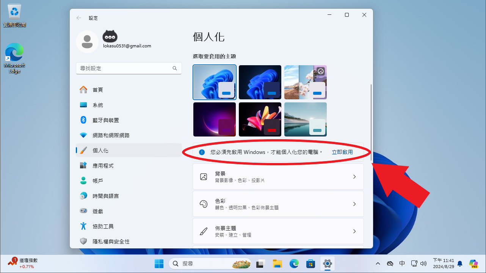
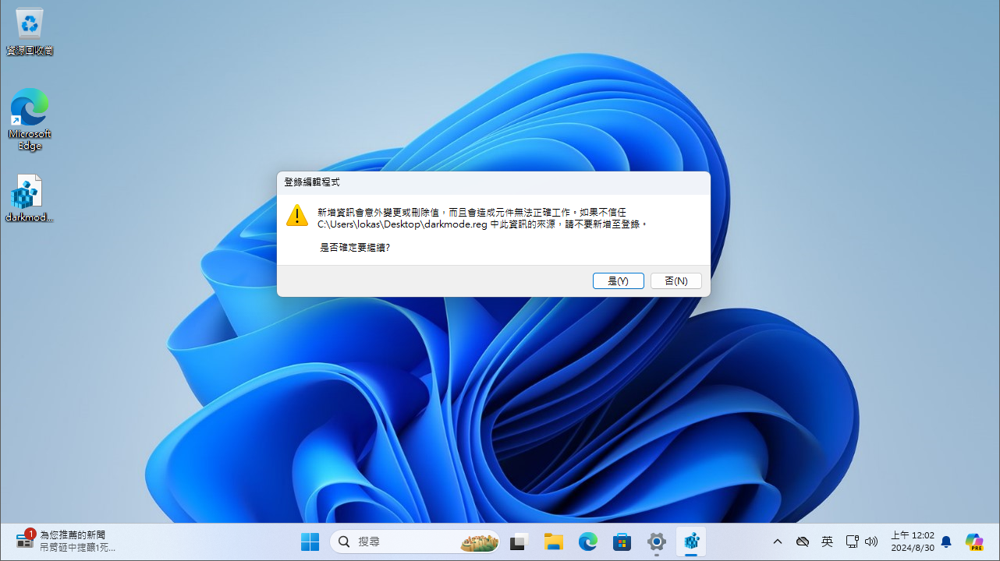
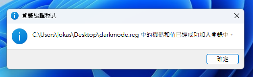
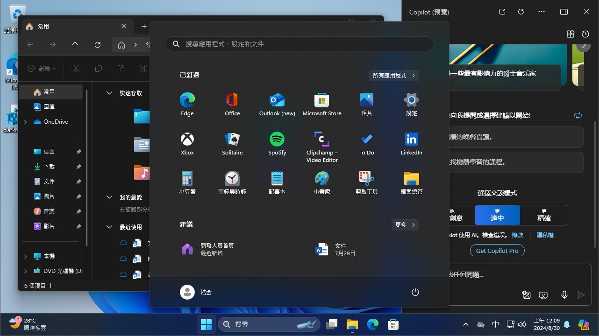

## 前言

寫教學文要是沒有圖誰看的下去？Github 上的 README 要是一張圖都沒有我就失去耐心了！於是弄了一個 VM 讓我可以重現安裝或是設置之類的過程。因為淺色主題太亮了所以只要我能切深色主題就切深色主題，包括現在這個網站，要是網站是深色的圖片卻是淺色的自己看了也不爽，那簡單啊！把 VM 也弄成深色主題不就好了？說幹就幹．．．欸？Windows 沒啟用不能個人化？！於是我就去官網拿了半年的免費金鑰試著啟用 Windows，想當然而是沒成功不然就不會有這篇文章了。不過既然我只是要深色模式，那沒必要執著於啟用 Windows 吧？這個想法突然閃過腦門．．．



## 正文

查了一下發現只要修改註冊表就可以了，不過在註冊表裡慢慢找太累了，直接用指令比較省事！首先新增一個文字文件隨便命名，以 `.reg` 結尾就行，比如我將他命名為 `darkmode.reg`。

:::important
注意副檔名必須是 `.reg` 而不是 `.txt` 喔，如果平常沒有顯示副檔名的人可能會不小心變成 `XXX.reg.txt`
:::

用任何文字編輯器開啟這個檔案，然後貼上下面這串指令：

```reg
Windows Registry Editor Version 5.00

[HKEY_CURRENT_USER\Software\Microsoft\Windows\CurrentVersion\Themes\Personalize]
"AppsUseLightTheme"=dword:00000000
"SystemUsesLightTheme"=dword:00000000
```

貼好後存檔並執行這個檔案，出現這個警告不要擔心，直接按是就可以了：



成功的話應該會出現這個提示：



接下來應該就可以看到某些東西已經變成深色的了，不過像是工具列之類的還是保持淺色，這時只要重新啟動就會全部正確套用了！



