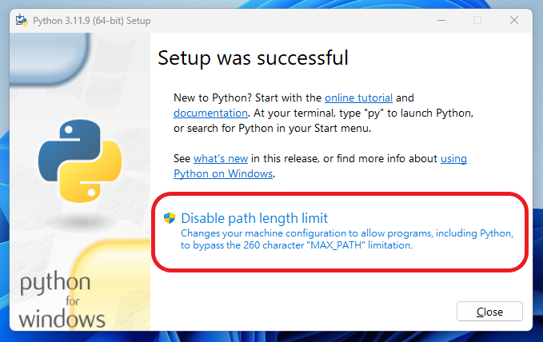

# 方法1：直接從Microsoft Store安裝

對沒錯，Microsoft Store裡可以直接安裝Python，一鍵安裝連環境變數都幫你搞定，打開Microsoft Store搜尋`python`，就可以看到很多種版本可以選：

至於要下載哪一版取決於你的需求，以及你所想要使用的套件的相依性，初學者的話也不用想太多，直接載最新的也行，想要穩定一點就載最新的前一版，這裡我就以`3.11`為例：

點進來後直接按`取得`，接著等它下載就可以了。安裝好後打開`Powershell`，輸入`python -V`確認是否成功安裝，這裡可以看到它輸出`3.11.9`，和我們在商店選擇的版本一致。

接下來輸入`pip -V`來確認pip是否成功安裝，pip是Python的軟體包管理系統，Python很具代表性的一大特色就是有許多第三方的package可以下載，所謂站在巨人的肩膀上就是這麼一回事！

出現類似這種訊息就是代表成功囉！從商店下載的好處就是以往初學者如果從官網下載，一直按下一步的話，可能就會有環境變數沒加到啊、pip沒一起下載之類的問題，從商店下載可以少走一些彎路。

# 方法2：從官網下載並安裝Python

2年前有在HackMD寫過類似的文章了，趁著這個機會再載載看過了2年有什麼改變。

## 下載

1. **搜尋Python**

2. **進入Python主頁** 找到`Downloads`點進去

3. **選擇版本** 雖然對於初學者來說安裝最新版也不會有太大的問題，加上寫文章的現在`3.13`已經預發佈了，`3.12`理論上是非常穩定的，所以還是像我上面說的，取決於你的需求，這裡一樣以`3.11.9`為例

這個時候你會發現有很多選項，其實就是依照你的作業系統來選擇，我目前是使用Windows x86-64架構的作業系統，所以毫無懸念就是要選Windows 64-bit的選項，這裡選擇下載`Windows Installer`，也就是最常見的那種安裝檔，這裡我也會使用這個檔案作為接下來的示範

## 開始安裝

1. 執行剛剛載下來的安裝檔

2. 勾選 `Add Python 3.exe to PATH`

:::important
對於初學者來說要編輯環境變數並不是這麼容易，這裡直接勾選讓程式自動幫你加
:::
3. 接下來選擇`Customize installation`，進行自定義安裝，並且在pip這欄打勾，如同上面所說，pip是Python的軟體包管理系統，之後會很常用到，比較新版的Python安裝程式已經會預先幫你打勾了，其他的就看個人需求

4. 之後基本上一路Next即可，詳細設定這裡不一一細說，至於安裝位置的部分，用預設的路徑即可，除非你有特殊需求或路徑潔癖（有這種潔癖嗎？

5. 按下安裝就大功告成啦，如果是Windows用戶，這一步可能會出現`Disable path length limit`選項，我會建議點選以免因為過深的資料夾嵌套導致程式無法正常運行

6. 重新啟動電腦並輸入`python -V`和`pip -V`來確認安裝

從官網下載安裝程式來安裝和兩年前差別不大，pip預設打勾是初學者福音。不過作為一個有多年Python經驗的雜魚程式設計師，當專案一多需要的套件也就混亂了起來，每個套件相依的Python版本也不同，不同專案也可能需要相同但不同版本的套件，造成管理上的困難，這時候就輪到虛擬環境出場啦！之後有空應該會出一篇miniconda的教學，至於Anaconda太肥了我不喜歡，嬌小可愛的酪梨誰不愛呢？

警察大人你聽我解釋．．．
