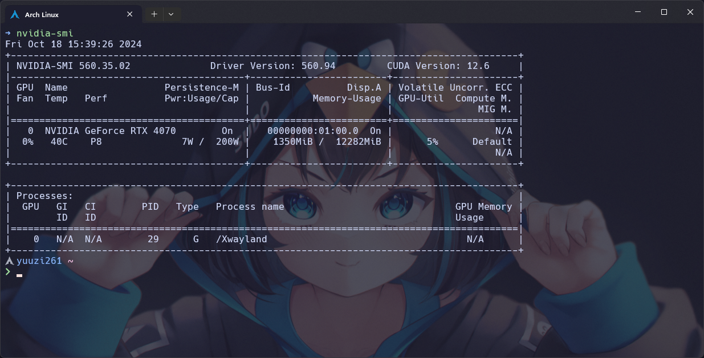
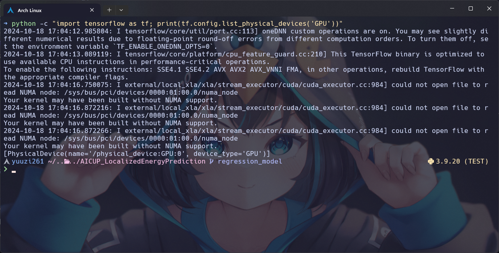

## 前言

這次學到的教訓就是不要用 TensorFlow 跟 Keras，有問題絕對不是 Arch Linux 的問題，都是我太爛駕馭不了的問題（Ｘ。總之我試了一天終於找到省事又方便的方法了，中間經歷了不少彎路，結果其實意外的簡單，趕緊把這些經驗記錄下來避免忘記也看看能不能幫到有需要的人！

## 安裝顯示卡驅動

這一步網路上很多資料了，這邊就先跳過，加上這一次我是用 WSL 來做，所以驅動早就搞定了，如果你跟我一樣也是用 WSL，並且驅動也早就裝好的話，那就可以直接跳過這一步，真爽！不過要注意驅動不能太舊，不然到時候沒有支援你要的 CUDA 版本就笑不出來了。

可以輸入下面的指令來確認驅動是否已經安裝，並且可以查看安裝的版本以及**最高**支援的 CUDA 版本：

```bash
nvidia-smi
```

如果驅動有正確安裝大概會出現這樣的畫面：



這裡有一篇很[完整的教學](https://ivonblog.com/posts/archlinux-install-nvidia-drivers/)可以看看他怎麼安裝驅動的，裝好再回來這裡，畢竟 CUDA 那些我不是很喜歡直接裝在系統環境，要切換版本比較不方便。

## 安裝套件/環境管理系統 Conda

Conda 是廣為人知的套件/環境管理系統，平常有在接觸 Python 的人應該不陌生，我們要透過他來管理不同專案要使用到的套件以及 CUDA、cuDNN 等等，方便在不同專案之間快速切換。

:::note
我這裡會使用 Miniconda，它比 Anaconda 更輕量，只需要安裝最小需求的套件：[Miniconda 文檔](https://docs.anaconda.com/miniconda/)。
:::

因為每個人的硬體以及作業系統不同，所以我這裡以 `Linux x86-64` 的版本為例，其他版本請見官方文檔，其實我下面的指令也是從文檔複製過來的笑死：

```bash
mkdir -p ~/miniconda3
wget https://repo.anaconda.com/miniconda/Miniconda3-latest-Linux-x86_64.sh -O ~/miniconda3/miniconda.sh
bash ~/miniconda3/miniconda.sh -b -u -p ~/miniconda3
rm ~/miniconda3/miniconda.sh
```

安裝好後使用這個指令暫時進入 conda 環境：

```bash
source ~/miniconda3/bin/activate
```

然後透過指令初始化 shell，這樣每次開啟 shell 就能直接用了：

```bash
conda init --all
```

如果不想每次開啟都進入 base 環境，可以使用下面的指令關閉這個功能（選用）：

```bash
conda config --set auto_activate_base false
```

## 安裝 TensorFlow、CUDA 以及其他依賴套件

接下就進入重頭戲了，我們必須確定 TensorFlow、CUDA、cuDNN 的版本是相容的，不然就會無法使用 GPU，首先，先確認要安裝的 TensorFlow 版本，所有版本與 CUDA 的對應關係都在 [TensorFlow 文檔](https://www.tensorflow.org/install/source)了，而且中文版已經年久失修，一定要切到英文版的才有比較新的資料，非常的坑，我這裡也列一下比較新的幾個。

| TensorFlow 版本 | Python 版本 | CUDA | cuDNN |
| --------------- | ----------- | ---- | ----- |
| 2.17.0          | 3.9 - 3.12  | 12.3 | 8.9   |
| 2.16.1          | 3.9 - 3.12  | 12.3 | 8.9   |
| 2.15.0          | 3.9 - 3.11  | 12.2 | 8.9   |
| 2.14.0          | 3.9 - 3.11  | 11.8 | 8.7   |
| 2.13.0          | 3.8 - 3.11  | 11.8 | 8.6   |
| 2.12.0          | 3.8 - 3.11  | 11.8 | 8.6   |
| 2.11.0          | 3.7 - 3.10  | 11.2 | 8.1   |

選好版本後就可以開始著手安裝啦！

```bash
conda create -n {env_name} python={py_version}
conda activate {env_name}
conda install nvidia/label/cuda-{cuda_version}::cuda
conda install -c conda-forge tensorflow={tf_version} cudnn={cudnn_version}
```

或是一行搞定：

```bash
conda create -n {env_name} -c conda-forge python={py_version} nvidia/label/cuda-{cuda_version}::cuda cudnn={cudnn_version} tensorflow={tf_version}
```

CUDA 方面我是使用 [nvidia 頻道](https://anaconda.org/nvidia/cuda)的完整包，我試了一陣子的 [cudatoolkits](https://anaconda.org/conda-forge/cudatoolkit) 總是缺東缺西的，實驗下來這樣比較穩！這樣一來即使系統環境完全沒有 CUDA 等相關套件依然可以非常順暢的透過虛擬環境使用 TensorFlow + GPU，現在就來測試看看能不能抓到 GPU：

```bash
python -c "import tensorflow as tf; print(tf.config.list_physical_devices('GPU'))"
```



上面一坨 info 基本上對結果沒有影響，主要看最下面那一行：

```
[PhysicalDevice(name='/physical_device:GPU:0', device_type='GPU')]
```

這樣就是有抓到了，可以開始愉快的訓練模型囉，如果你有多張 GPU 這裡可能就會出現不止一個。其實這樣整理下來確實步驟挺簡單的，不過我沒有研究如果要 TensorRT 的話怎麼辦，我目前是沒有這個需求，如果以後有遇到再來研究好了，印象中 TensorRT 有授權的問題似乎比較麻煩。
