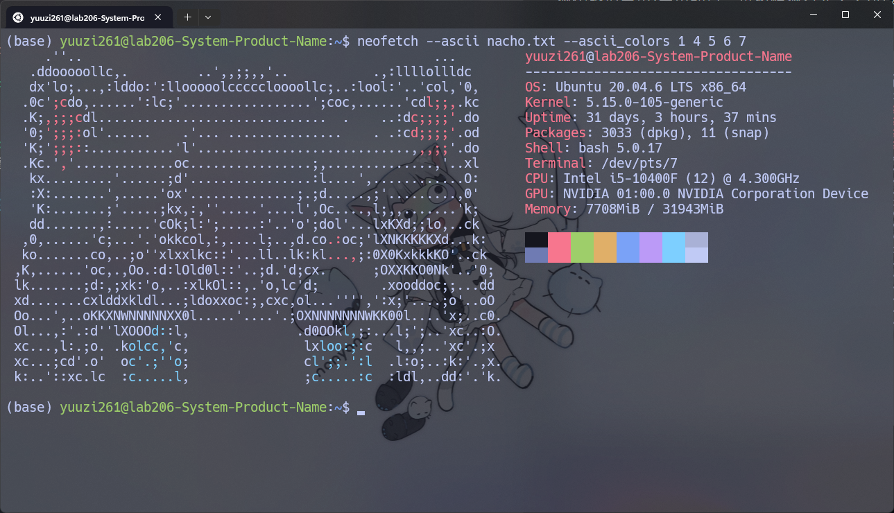
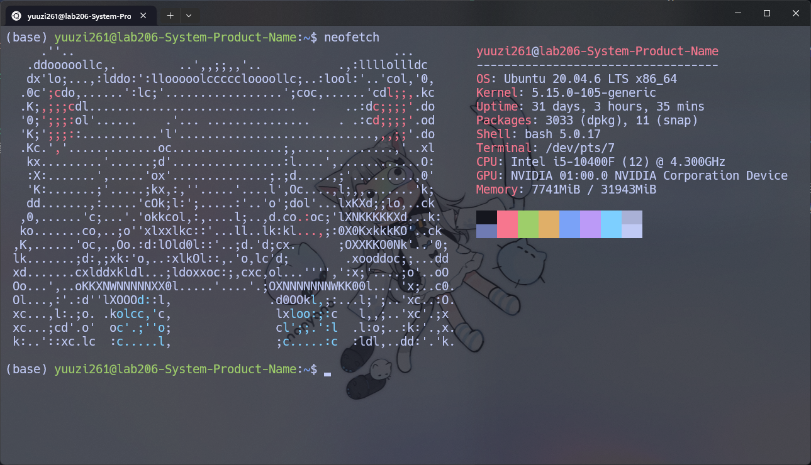

## 使用 jp2a 轉換圖片為 ASCII 藝術

單純使用 jp2a 轉換的話它會直接輸出到 terminal 上面，但上面的顏色訊息無法複製，所以我們要透過這個[**簡單的腳本**](https://gist.github.com/OpenBagTwo/54f209cbe8abbd04b9d5b0b880b6a8a2)處理 jp2a 的輸出並寫入到一個 txt 檔案裡面，這個檔案就可以在之後被我們指定為 neofetch 的 ASCII logo。

依照腳本原作者的指南，我們首先要在主機上準備好腳本和圖片 _(必須是 jpg 格式)_ ，接著輸入以下指令

```bash
jp2a logo.png --color-depth=4 --width=48 | ./jp2a2neofetch.py > neofetch_logo.txt
neofetch --ascii neofetch_logo.txt --ascii_colors 1 4 5 6 7
```

第一行指令的 `--color-depth` 和 `--width` 可以自行定義，依照自己的需求修改，如果發現圖片轉換後發現白色/黑色的背景也被轉換為文字，可以使用 `-i` 加在 `jp2a` 指令的後面。



## 將預設 Logo 設為自定義的 ASCII 藝術

如果每次都要打這些參數，不免讓人覺得有些不方便，所以接下來我們要修改設置文件，將自定義的圖片作為預設。

首先要找到設置文件，Linux 預設放在 `~/.config/neofetch/config.conf`，Windows 則是 `%userprofile%\.config\neofetch\config.conf`，找到之後編輯文件。

找到 `image_source="auto"` 這行，將 `auto` 改成自定義圖片的路徑就可以囉。這樣只打 `neofetch` 也能顯示自定義的圖片了!


