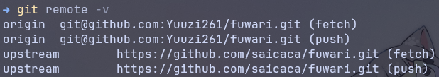
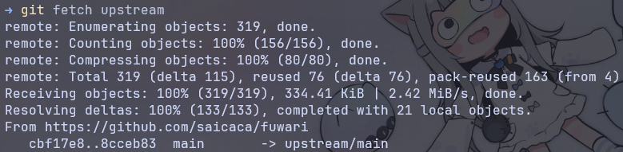
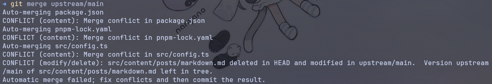

## 前言

很明顯的這個 blog 是直接套別人寫好的模板來改的，過了好一陣子是時候把更新都拉過來了，想當然而的又會出現衝突，所以就趁著這個機會順便寫一篇文章好了！話說上一篇解決 Arch Linux 問題的文章還真的幫助到了未來的自己，果然隨手紀錄一下自己又在搞什麼鬼還是挺有幫助的！

## 開始同步

### Step.1 新增上游遠端（Upstream Remote）

先檢查一下當前有哪些遠端設定，我因為之前弄過了所以已經新增好了上游遠端：

```bash
git remote -v
```



如果還沒有上游遠端的話就加上去：

```bash
git remote add upstream <upstream-repo-URL>
```

### Step.2 取得上游的變更

執行指令抓取上游 repo 的最新更新：

```bash
git fetch upstream
```



這個指令會將上游 repo 的所有分支下載到本地，但不會自動合併。

### Step.3 切換到你要更新的分支

這裡就是因人而異了，現在大部分的 repo 的主要分支都是 `main`：

```bash
git checkout main
```

比較古老的 repo 可能會是 `master`：

```bash
git checkout master
```

### Step.4 合併上游的更新

有兩種常見方式可以合併上游變更到你的分支中：`merge` 或 `rebase`。

#### Step.4.1 方法A：merge

這種方式會將上游的變更與你目前的 commit 歷史合併，產生一個新的 merge commit。

```bash
git merge upstream/main
```

我這次選擇 merge：



一樣，某些 repo 可能會是：

```bash
git merge upstream/master
```

#### Step.4.2 方法B：rebase

這種方式會把你的變更移動到上游最新 commit 之後，使 commit 歷史更為整潔。如果你的變更已經推到遠端，使用 rebase 可能會帶來一些問題。

```bash
git rebase upstream/main
```

或是：

```bash
git rebase upstream/master
```

### Step.5 解決衝突

想當然而會有衝突，不然你現在就不會在看這篇文章了，沒衝突的話直接在 Github 上按一下 sync 就直接搞定走人：

```bash
git add <resolve-conflicting-files>
```

或是你像我一樣懶惰直接：

```bash
git add .
```

接下來要提交：

- merge

```bash
git commit -m "commit message"
```

- rebase

```bash
git rebase --continue
```

### Step.6 推送到遠端

完成合併或 rebase 後，將更新推送到你在 GitHub 上的 fork：

```bash
git push origin main
```

如果使用 rebase 並且已經推到遠端過，可能需要強制推送（強制推送的時候要特別注意，尤其是和團隊協作時）：

```bash
git push -f origin main
```

這樣就搞定啦，等以後我又忘記的時候就來看自己寫的東東（欸嘿～
