# 前言

最近突然覺得自己常常耍廢摸魚得過且過感覺未來會暴死，經過深刻的反省之後決定把這學期上課的內容整理成筆記放到 blog 裡，希望這個系列能夠安穩落地。因為目前才剛開始教所以分類會有些隨便，以後滾動調整吧～

---

# 緒論

## 關於訊號

- 訊號：資訊的流動
- 訊號處理：生成、轉換和解釋資訊的關鍵技術
- 數位訊號處理：使用電腦處理訊號

## 訊號的分類與轉換

訊號主要分為兩大類 ：

1. **連續時間訊號 (Continuous-time, CT)**：標記為 $x(t)$
2. **離散時間訊號 (Discrete-time, DT)**：標記為 $x[n]$，其中 $n$ 為整數 $(0, 1, 2, \ldots)$

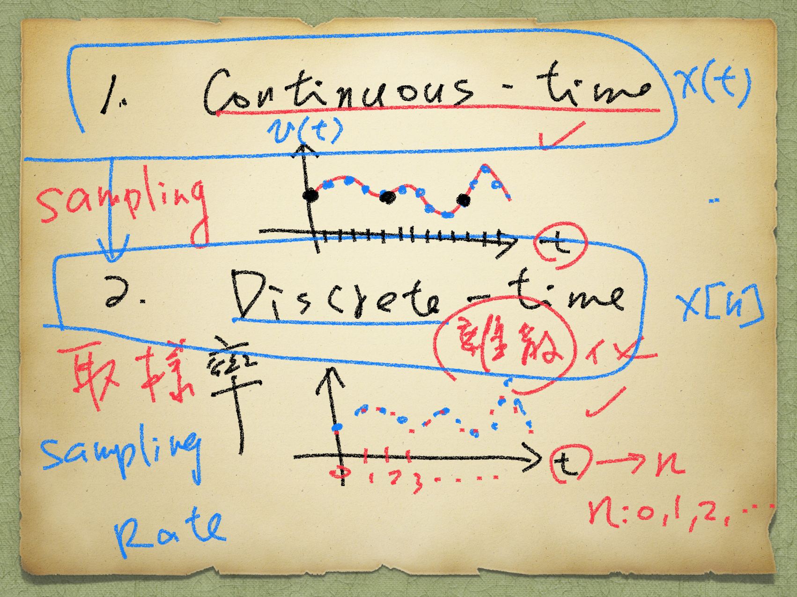

連續時間訊號經過取樣(Sampling)後轉換為離散訊號，取樣率是一個至關重要的參數，它決定了你每秒鐘要抓取多少個點。取樣率越高，還原出來的訊號就越接近原始的連續狀態。

### 類比轉數位 (A/D Conversion)

訊號從連續時間訊號轉為類比訊號需要經過兩個步驟，分別是取樣(Sampling)以及量化(Quantization)：

$$
CT \xrightarrow{Sampling} DT \xrightarrow{Quantization} Digital
$$

- **取樣（時間離散化）**：將 $x(t)$ 轉換為 $x[n]$，決定了訊號的**頻率範圍**
    - 取樣週期($T$)：兩次取樣之間的時間間隔
    - 取樣率/頻率($f_s$)：$f_s = \frac{1}{T}$
    - 關係式：$t = n \cdot T$
- **量化（數值離散化）**：將連續的振幅值轉為有限精度的數位資料，決定了訊號的**動態範圍與細節**

## 基礎離散時間訊號

1. **單位樣本序列 (Unit Sample Sequence / Impulse)**

    標記為 $δ[n]$，其定義如下 ：

    $$
    δ[n] = 
    \left\{ 
    \begin{array}{ll}
        1, & n = 0 \\
        0, & n \neq 0
    \end{array}
    \right.
    $$

    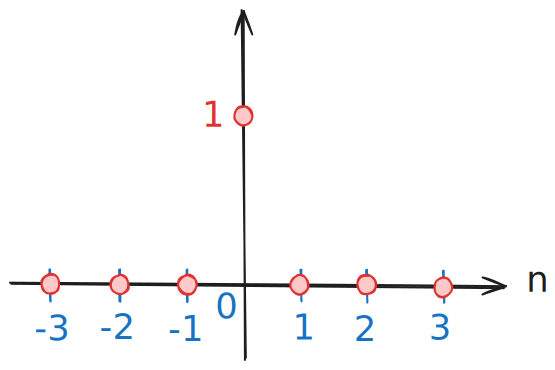

2. **單位步階序列 (Unit Step Sequence)**

    標記為 $u[n]$，其定義如下 ：

    $$
    u[n] = 
    \left\{ 
    \begin{array}{ll}
        1, & n \ge 0 \\
        0, & n < 0
    \end{array}
    \right.
    $$

    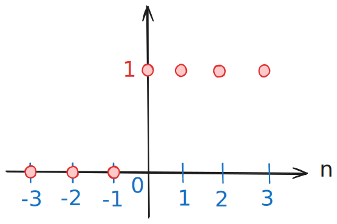

3. **指數序列 (Exponential Sequence)**

    形式為 $x[n] = A \cdot \alpha^n$，$A$ 與 $\alpha$ 可為實數或複數

## 重要數學性質與表示法

### 任意序列的表示 (Representation of Arbitrary Sequence)

任何離散序列 $x[n]$ 都可以表示為一組加權且延遲的單位脈衝之和 ：

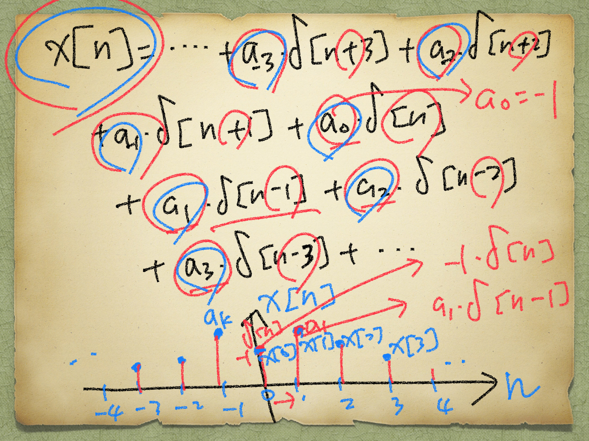

寫成一般式（$a_k$ 即為 $x[k]$ 的值）：

$$
x[n]=\sum_{k=-\infty}^\infty {{\color{#3071c4} a_k} \cdot \delta[n-k]}=\sum_{k=-\infty}^\infty {{\color{#3071c4} x[k]} \cdot \delta[n-k]}
$$
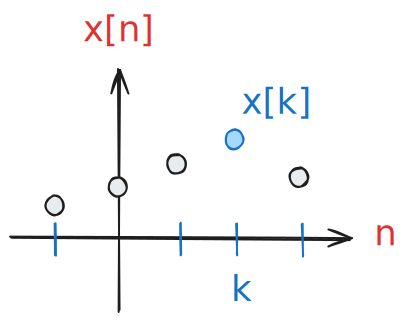

**$u[n]$ 與 $\delta[n]$ 的關係**

- **累加關係：** $u[n]=\sum_{k=0}^\infty \delta[n-k]$ 或 $u[n]=\sum_{k=-\infty}^n \delta[k]$
- **差分關係：** $\delta[n]=u[n]-u[n-1]$

### 複數平面與尤拉公式 (Euler's Formula)

在處理複數指數訊號時常用到：

- 尤拉公式：$e^{j \phi}=\cos \phi+j\sin \phi$
- 極座標表示：$A=|A| e^{j \phi_1}$，$\alpha= |\alpha| e^{j \phi_2}$
- 因此 $x[n]=A \alpha^n= |A| |\alpha|^n e^{j(n \phi_2 + \phi_1)}$

_✍️TODO 以後想到再補圖_

---

# 訊號取樣的影響

## 取樣與混疊

### 基本定義

假設一個連續時間訊號 $x(t) = \cos(\omega t)$
- $\omega$：角頻率 (Radian Frequency)，單位：rad/s（徑度/秒）
- $t$：連續時間，單位：sec（秒）

:::note
複習一下高中內容：在圓周運動或簡諧運動的數學推導中，如果使用「圈數」，公式裡會不斷出現 $2 \pi$ 這個係數，顯得累贅。為了讓方程式更簡潔，我們直接把 $2 \pi$ 乘進去，定義出角頻率（以 $\omega$ 表示）
:::

### 取樣過程（Sampling Process）

1. 每隔 $T$ 秒取樣一次，$T$: 取樣週期 (Sampling Period)
    $$
    \begin{aligned}
    {\text{時間 } t\text{：}} & 0, T, 2T, 3T, \ldots \\
    t &= nT \\
    n &= 0, 1, 2, 3, \ldots
    \end{aligned}
    $$

2. 離散化
    $$
    \begin{aligned}
    x(t) &= \cos(\omega {\color{#3071c4}t}) \\
    &\downarrow {\color{#3071c4}t = nT} \\
    x({\color{#3071c4}nT}) &= \cos(\omega {\color{#3071c4}nT}) \\
    &\Downarrow \\
    x[n] &= \cos(\omega nT)
    \end{aligned}
    $$

3. 取樣頻率轉換
    取樣頻率：$f_s = \frac{1}{T}$ Hz，取樣角頻率為 $\omega_s = \frac{2 \pi}{T}$ rad/s
    :::tip
    $\omega = 2 \pi f \xrightarrow{f = \frac{1}{T}} \omega = \frac{2 \pi}{T}$
    :::

### 離散時間的週期性 (Periodicity in Discrete Time)

假設這裡有兩個訊號：$x$ 和 $x_1$

$$
\left\{ 
\begin{array}{ll}
    x &= \cos(\omega t) \\
    x_1 &= \cos((\omega + {\color{#3071c4}\omega_s})t)
\end{array}
\right.
$$

很明顯這是兩個不一樣頻率的訊號，但如果我們對它們進行採樣，會發現一個很有趣的現象：

$$
\begin{aligned}
x_1(t) &= \cos((\omega+\omega_s)t) \\
&\downarrow t = {\color{#3071c4}nT} \\
x_1[n] &= \cos((\omega+\omega_s){\color{#3071c4}nT}) \\
&\because \omega_s = \frac{2\pi}{T} \\
\therefore x_1[n] &= \cos((\omega+\frac{2\pi}{T})\cdot nT) \\
&= cos(\omega nT+\frac{2\pi}{\cancel{T}}\cdot n\cancel{T}) \\
&= cos(\omega nT+{\underbrace{2\pi n}_{\color{#e53935}{2\pi\text{ 的整數倍，不影響值}}}}) \\
&= cos(\omega nT)
\end{aligned}
$$

可以觀察到雖然 $x$ 跟 $x_1$ 不同，但取樣後都是 $cos(\omega nT)$，$\therefore x[n] = x_1[n]$。

:::note
這裡再假設一個 $x_2(t) = \cos((-\omega+{\color{#3071c4}\omega_s})t)$，取樣後會得到 $x_2[n] = \cos(-\omega nT)$，但因為 cosine 是偶函數，所以 $x_2[n] = \cos(-\omega nT) = \cos(\omega nT) = x[n]$
:::

我們可以得到一個結論，在離散的世界裡，很多不同頻率的連續波，採樣後居然會看起來一模一樣，這個就是所謂的 **「混疊現象」(Aliasing Phenomenon)**。

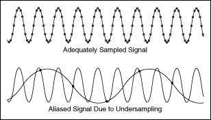

<small>🔗圖片來源：https://www.ni.com/docs/zh-TW/bundle/labwindows-cvi/page/advancedanalysisconcepts/aliasing.html</small>

## 奈奎斯特-香農取樣定理

我們現在知道如果取樣頻率不夠高，就會在這種週期性的訊號上產生混疊現象，那如果不想要產生混疊現象的話，具體來說需要多高的取樣頻率呢？**奈奎斯特-香農取樣定理**給出了答案，並定義了所謂的**奈奎斯特頻率 (Nyquist Frequency)**，又或者稱作**奈奎斯特極限 (Nyquist Limit)**。

- **奈奎斯特極限：** 能被系統唯一表示的最高頻率為 $\frac{\omega_s}{2}$
- **發生混疊的條件：** 如果輸入訊號的最高頻率 $\omega_N > \frac{\omega_s}{2}$，就會發生混疊
- **取樣定理：** 假設一個連續時間訊號 $x(t)$，它是一個**頻帶受限訊號 (band-limited signal)**，最高頻率為 $\omega_N$，寫成數學式：$X(j\omega) = 0 \text{ for } |\omega| \ge \omega_N$（所有比 $\omega_N$ 大的頻率都不存在 $\rightarrow X(j\omega) = 0$）。如果我們以 $\omega_s \ge 2\omega_N$ 的頻率對其進行取樣，那麼這個連續訊號 $x(t)$ 就可以 **唯一地 (uniquely)** 被它的離散取樣點 $x[n]$ 所決定。換句話說，只要取樣正確，就能拿這些離散的點拼湊回原本的 $x(t)$

:::tip[頻帶受限訊號 (Band-Limited Signal)]
指其頻譜能量集中在有限的頻率範圍內的訊號，簡單來說，它的頻率是有上限的 ($\omega_{max} < \infty$)。
:::

#### 完美還原訊號的數學條件

$$
\begin{aligned}
&\text{if } \overbrace{\omega_s}^{\color{#3071c4}\text{取樣頻率}} \ge \overbrace{2\omega_N}^{\color{#e53935}\text{最高訊號頻率}} \\
&\text{i.e. , Nyquist Limit } \frac{\omega_s}{2} \\
&\omega_N \le \frac{\omega_s}{2} \color{#3071c4}{\Rightarrow \omega_s \ge 2\omega_N} \\
&\omega_s = \frac{2\pi}{T} \Rightarrow T = \frac{2\pi}{\omega_s}
\end{aligned}
$$

## 反混疊濾波器

_✍️TODO 以後補_

## 範例與練習

### Ex.1

Determine which input signals to a digital filter or DSP system will be aliased by the given period $\text{Т}$?

1. $x(t) = 2\cos(10t)\text{ , T = 0.1s}$
2. $x(t) = 8\cos(15t)\text{ , T = 0.2s}$

:::note[ANS]
1. $\omega_s = \frac{2\pi}{T} = \frac{2\pi}{0.1} = 20\pi$  
    Nyquist Frequency: $\frac{\omega_s}{2} = 10\pi\approx 31.4$  
    $\therefore \omega_N = 10 < \frac{\omega_s}{2}$，沒有混疊
2. 同理，$\frac{\omega_s}{2} = \frac{\frac{2\pi}{0.2}}{2} = 5\pi\approx 15.7$  
    $\therefore \omega_N = 15 < \frac{\omega_s}{2}$，沒有混疊
:::

### Ex.2

Determine if the following signals will be aliased. If the signal is aliased into having the same sample value as a lower frequency sinusoidal signal, determine the lower sinusoidal signal.

1. $x(t) = 7\cos(25t)\text{ , T = 0.1s}$
2. $x(t) = 3\cos(160t)\text{ , T = 0.02s}$

:::note[ANS]
1. $\frac{\omega_s}{2} = \frac{\frac{2\pi}{0.1}}{2} = 10\pi\approx 31.4$  
    $\therefore \omega_N = 25 < \frac{\omega_s}{2}$，沒有混疊
2. $\frac{\omega_s}{2} = \frac{\frac{2\pi}{0.02}}{2} = 50\pi\approx 157$  
    $\therefore \omega_N = 160 > \frac{\omega_s}{2}$，有混疊  
    由於[混疊高頻摺疊至低頻的現象](#離散時間的週期性-periodicity-in-discrete-time)，$-\omega_1 + \omega_s = 160$  
    又 $\omega_s = 100\pi \Rightarrow \omega_1 = 100\pi - 160$  
    $\therefore x_1(t) = 3\cos((100\pi - 160)t) \approx 3\cos(154.2t)$
:::

---

# 數位濾波器規格

## 基礎概念與公式

在介紹數位濾波器之前，要先了解一下下面這三個東西，它們是衡量一個濾波器好不好用、有沒有效的核心概念：

- **增益 (Gain)**
    - $Gain = \frac{\text{輸入訊號的振幅}}{\text{輸出訊號的增幅}}$
    - 如果 $Gain = 1$，代表訊號無損通過。在濾波器中，這就是我們希望保留訊號的區域，稱為 **通帶 (Pass Band)**
    - 如果 $Gain$ 趨近於 $0$，代表訊號被擋下或大幅削弱。這就是我們希望濾除雜訊的區域，稱為 **阻帶 (Stop Band)**
- **損失 (Loss)**
    - 增益的倒數，即 $Loss = {(Gain)}^{-1}$，本質上是一樣的東西，只是換個角度描述
- **分貝 (dB)：** 現實世界的訊號強弱差異極大，如果我們在定義濾波器規格的時候只使用倍數來表示，數值會變得極端並且難以繪圖，比如 $\text{通帶}:\text{阻帶} = 1 : 10^{-6}$。為了閱讀和計算的方便性，分貝這個單位就出現了，它利用對數的性質將巨大的倍數差異壓縮成好處理的數字
    - 分貝轉換公式：$Gain_{\color{#3071c4}{dB}} = 20\cdot\log_{\color{#e53935}{10}}(Gain)$
    - 無變化時（$1$ 倍）：$Gain = 1$，$20\cdot\log_{10}(1) = 0\text{ dB}$，因此 $0\text{ dB}$ 在圖表中常常被用來代表訊號的基準線
    - 訊號放大時（假設 $2$ 倍）：$20\cdot\log_{10}(2) \approx 6\text{ dB}$
    - 訊號衰減時（假設 $10^{-4}$ 倍）：$20\cdot\log_{10}(10^{-4}) = -80\text{ dB}$

:::tip[REMARK]
以分貝作為單位的時候，增益和損失的關係變得更加簡單：
$$
\begin{aligned}
& \because\cancel{20}\cdot\log_{10}(Loss) = \cancel{20}\cdot\log_{10}((gain)^{-1}) \\
& \therefore Loss = -Gain
\end{aligned}
$$
:::

#### 奈奎斯特頻率 / 摺疊頻率（Nyquist / Folding frequency）

$$
\begin{aligned}
\frac{\omega_s}{2} &= \frac{\cancel{2}\pi \cdot f_s}{\cancel{2}} \\
\because T &= \frac{1}{f_s}, \quad T: \text{Sampling Period} \\
\therefore \frac{\omega_s}{2} &= \pi \cdot \frac{1}{T} = \frac{\pi}{T}
\end{aligned}
$$

## 濾波器與規格參數

頻率響應的圖表主要由通帶 (Pass Band)、阻帶 (Stop Band) 與 過渡帶 (Transition Band) 組成。

- **增益規格（Gain spec.）：**
    - $g_{pmax}$​：通帶內允許的最大增益
    - $g_{pmin}$​：通帶內允許的最小增益
    - $g_{smax}$：阻帶內允許的最大增益
- **頻率規格（Frequency spec.）：**
    - $\omega_{p}$​：通帶內的最高頻率
    - $\omega_{s}$​：阻帶內的最低頻率
    - $\omega_{f}$​：摺疊頻率，也就是奈奎斯特頻率，取樣頻率的一半 $\frac{\omega_{sampling}}{2}$

### 低通濾波器規格 (Lowpass Digital Filter Specification)

- 概念圖
    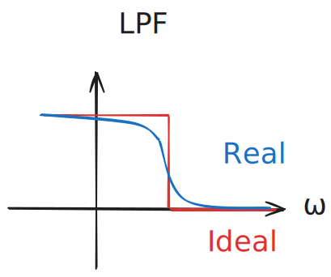
- 規格定義圖
    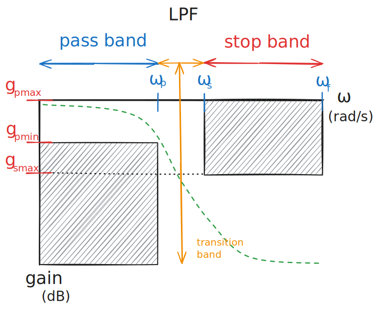
    :::note
    在工程設計中，只要增益曲線（綠線）不要碰到「容差邊限」或稱「禁制區」（黑色的斜線區域）就是合格的濾波器了
    :::

### 高通濾波器規格 (Highpass Digital Filter Specification)

- 概念圖
    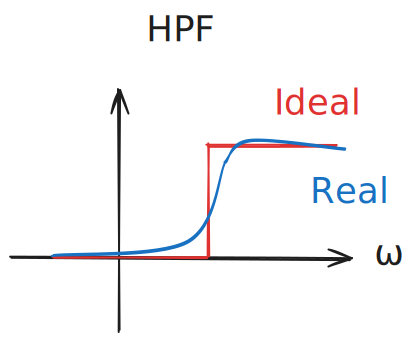
- 規格定義圖
    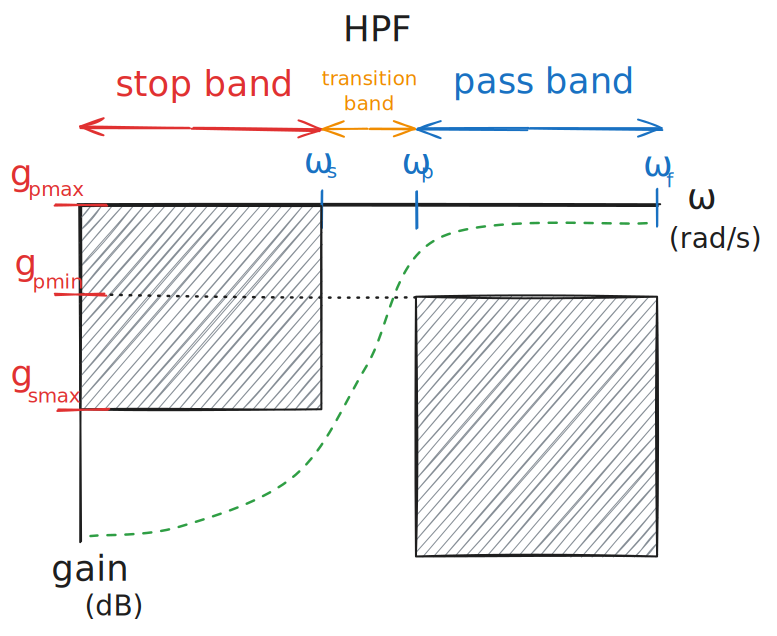

### 帶通濾波器規格 (Bandpass Digital Filter Specification)

- 概念圖
    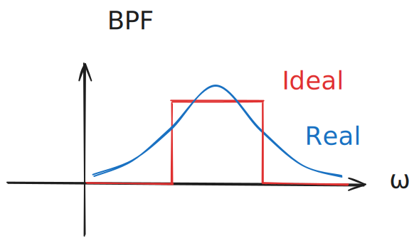
- 規格定義圖
    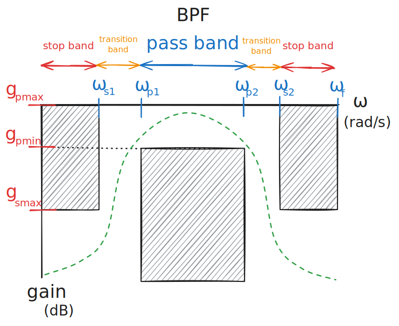

### 帶阻濾波器規格 (Bandstop Digital Filter Specification)

- 概念圖
    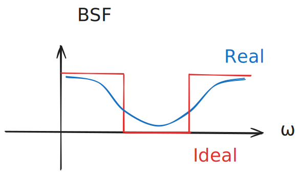
- 規格定義圖
    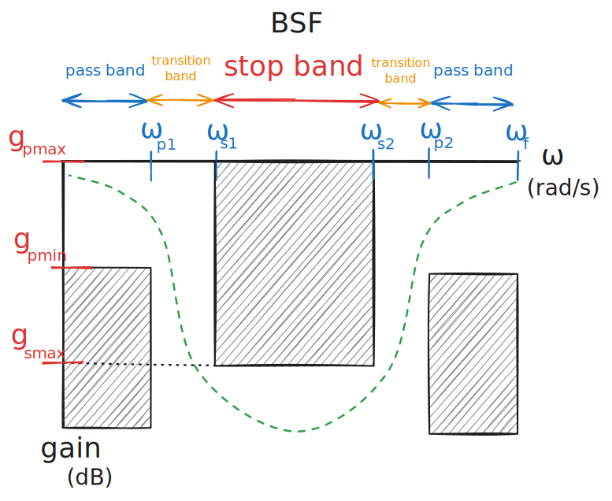
    :::tip
    某些帶阻濾波器又被稱為**帶陷濾波器 (Notch Filter)**，Notch 是凹口或是刻痕的意思，一般來說，Notch Filter 專指頻帶非常窄的帶阻濾波器。
    :::

## 濾波器的實際應用

- 低通濾波器
    1. 降噪，如 ECG 或 EEG 等生醫訊號及音訊處理
    2. 抗混疊濾波器
    3. 影像處理
- 高通濾波器
    1. 去除直流成分
    2. 影像邊緣偵測
- 帶通濾波器
    1. 無線通訊
    2. 生醫訊號處理
    3. 語音訊號處理
- 帶阻濾波器
    1. 消除電源線干擾
    2. 語音通訊
- 全通濾波器（增益維持1）
    1. 相位補償
    2. 多通道通訊系統中的訊號對齊

## 範例與練習

### Ex.1

Draw the graphical specification for a digital highpass filter out to the folding frequency in rad/s that will not change the gain above 500 rad/s by more than ±3 dB, while reducing the gain below 200 rad/s by more than 40 dB.
The sampling time T = 0.001 s.

:::note[ANS]
1. 先確定 x 軸的盡頭，也就是 $\omega_f$ 的部分，由於取樣時間 $T = 0.001\text{s}$  
    $\because\text{Nyquist Frequency} = \frac{\pi}{T}$ [💡為什麼？](#奈奎斯特頻率--摺疊頻率nyquist--folding-frequency) 
    $\therefore \omega_f = \frac{\pi}{0.001} = 1000\pi$
2. 畫出阻帶，題目說 200 rad/s 以下增益要衰減 40 dB，因此阻帶容許最大增益為 -40 dB，即 $g_{smax} = -40\text{ db}$
3. 畫出通帶，題目說 500 rad/s 以上增益改變不能超過 ±3 dB，以無損增益 0 dB 為基準，可得知允許的範圍最高 $g_{pmax} = 3\text{ dB}$，最低 $g_{pmin} = -3\text{ dB}$

規格圖如下所示：
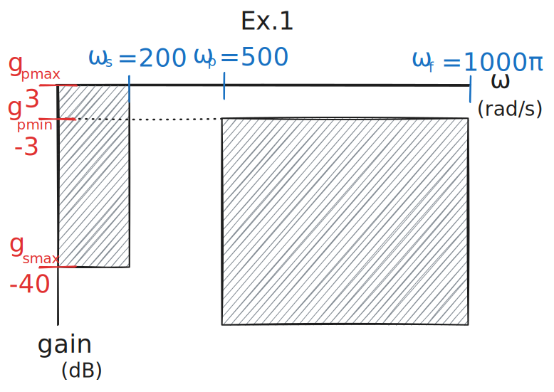
:::

### Ex.2

Draw the graphical specification for a bandstop digital filter out to its folding frequency that will reduce the gain between 1,000 rad/s and 5,000 rad/s by more than 60 dB, but will not reduce the gain above 10,000 rad/s or below 150 rad/s by more than 3 dB. The sampling rate is 10,000 Hz.

:::note[ANS]
$\text{Nyquist Frequency} = \frac{\omega_s}{2} = \frac{\cancel{2}\pi\cdot f_s}{\cancel{2}} = 10000\pi$  
後面跟上一題類似故省略  
規格圖如下所示：
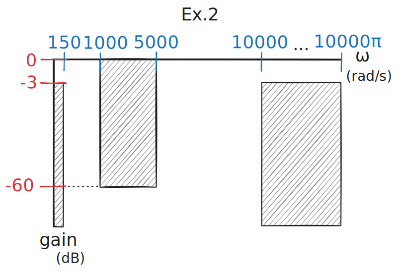
:::

---

# Z 轉換

取樣並獲得了離散的數據後，我們通常想要對它進行一些處理，例如我們上一個主題講到的濾波器，用來去除雜訊或增強特定頻率。但在時域進行分析非常困難，因此我們會希望對訊號進行轉換，並在「頻域」來分析離散系統。

在連續系統中，我們使用拉普拉斯轉換 (Laplace Transform)；而在離散系統中，對應的工具就是 **Z 轉換 (Z-Transform)**。

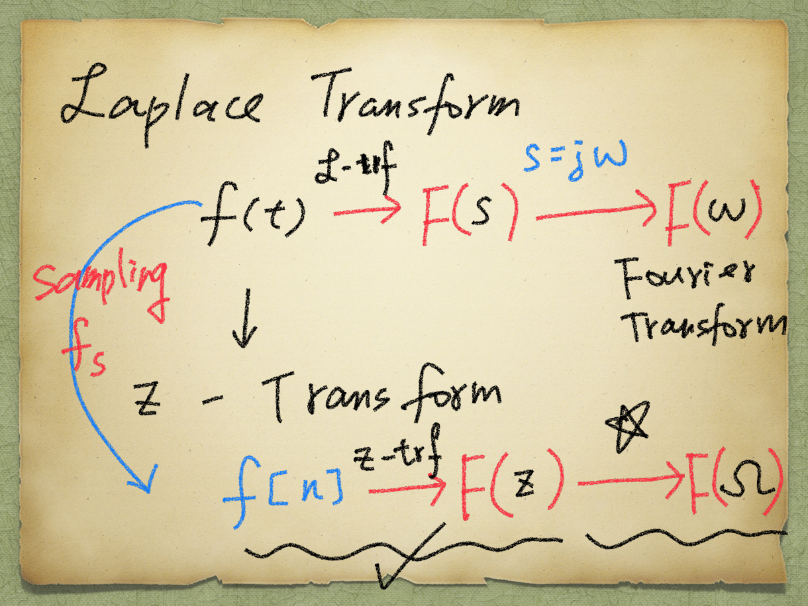

## 為什麼要轉到頻域？

工程師偏好在頻域處理問題，最主要的原因是運算邏輯的簡化：在時域極為複雜的「卷積」運算，轉到頻域後會變成簡單的「乘法」。

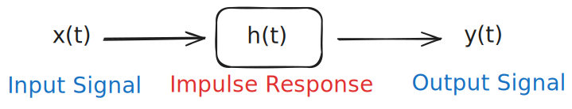

| 特性 | 時域 (Time Domain) | 頻域 (Frequency Domain) |
| :--- | :--- | :--- |
| **運算邏輯** | 卷積 (Convolution) $*$ | 乘法 (Multiplication) $\cdot$ |
| **連續訊號** | $y(t) = x(t) * h(t)$ | $Y(s) = X(s) \cdot H(s)$ |
| **離散訊號** | $y[n] = x[n] * h[n]$ | $Y(z) = X(z) \cdot H(z)$ |

### 正規化角頻率 (Normalized Angular Frequency)

在處理離散訊號時，為了避免公式裡一直帶著取樣週期 $T$ 而顯得臃腫，我們通常會定義一個新的變數：

$$
\begin{aligned}
f(t) &= \cos(\omega{\color{#3071c4}\cdot} t) \\
&\quad {\color{#3071c4}let}\downarrow{\color{#3071c4}t=n\cdot t}{\color{#e53935}\text{ <Sampling>}} \\
f[n] &= \cos(\omega{\color{#3071c4}\cdot n\cdot t}) = \cos(\omega T\cdot n) \\
&\quad {\color{#3071c4}let}\downarrow{\color{#3071c4}\Omega=\omega T} \\
&= \cos({\color{#3071c4}\Omega}n)
\end{aligned}
$$

這裡的 $\Omega = \omega T$ 稱為 **離散角頻率** 或 **正規化角頻率**，單位為 rad。

## Z 轉換定義

將離散訊號 $f[n]$ 進行 Z 轉換得到 $F(z)$ 的一般式如下：

$$
F(z) = \sum\limits_{n=-\infty}^{\infty}f[n]\cdot z^{-n}
$$

若訊號具備因果性（即從 $n = 0$ 開始），則公式縮減為：
$$F(z) = \sum\limits_{n=0}^{\infty}f[n]\cdot z^{-n}$$

## 基礎訊號轉換範例

### 1. 單位樣本/脈衝訊號 (Unit Impulse)

根據定義，$\delta[n]$ 只在 $n=0$ 時有值，其餘皆為 0。

$$
\begin{aligned}
z(\delta[n]) &= \sum\limits_{n=-\infty}^{\infty}\delta[n]\cdot z^{{\color{#e53935}-n}} \\
&= \delta[0]\cdot z^{{\color{#e53935}-}0} = 1\cdot 1 = 1
\end{aligned}
$$

#### 💡 Example: 組合脈衝訊號
Use the unit-sample signal to describe a sampled data where the initial sample $x[0]=2$, $x[3]=-2$ and the rest of the samples are zero.

**Step 1. 寫出離散表示式：**
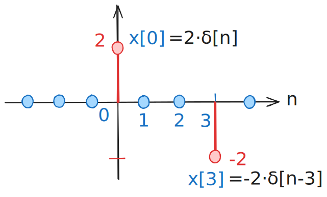
$$x[n] = 2\cdot \delta[n] - 2\cdot \delta[n-3]$$

**Step 2. 進行 Z 轉換：**
$$
\begin{aligned}
X(z) &= \sum\limits_{n=-\infty}^{\infty}x[n]\cdot z^{-n} \\
&= x[0]\cdot z^{-0} + x[3]\cdot z^{-3} \\
&= 2 - 2z^{-3}
\end{aligned}
$$

### 2. 單位步階訊號 (Unit-step Signal)

對於 $u[n]$，訊號在 $n \ge 0$ 時恆為 1。

:::tip[REMARK]
當 $|r| < 1$ 時，無窮等比級數之和為：
$1 + r + r^2 + r^3 + \dots = \frac{1}{1-r}$
:::

將 $u[n]$ 代入 Z 轉換公式，令 $r = z^{-1}$：
$$
\begin{aligned}
Z(u[n]) &= 1 + z^{-1} + z^{-2} + z^{-3} + \dots \\
&= \frac{1}{1-z^{-1}} = \frac{z}{z-1}
\end{aligned}
$$

## Z 轉換常用對照表

| Analog Signal | Sampled Signal | Z-transformed Signal |
| :--- | :--- | :--- |
| | $A\delta[n]$ | $A$ |
| $Au(t)$ | $Au[n]$ | $\frac{Az}{z - 1}$ |
| $Ae^{-at}u(t)$ | $Ae^{-aTn}u[n]$ | $\frac{Az}{z - e^{-aT}}$ |
| | $Ac^n u[n]$ | $\frac{Az}{z - c}, c = e^{-aT}$ |
| $Atu(t)$ | $AnTu[n]$ | $\frac{ATz}{(z - 1)^2}$ |
| $A\cos(\omega t)u(t)$ | $A\cos(\omega Tn)u[n]$ | $\frac{Az[z - \cos(\omega T)]}{z^2 - 2z\cos(\omega T) + 1}$ |
| $A\sin(\omega t)u(t)$ | $A\sin(\omega Tn)u[n]$ | $\frac{Az\sin(\omega T)}{z^2 - 2z\sin(\omega T) + 1}$ |
| $Ae^{-at}\cos(\omega t + \alpha)u(t)$ | $Ac^n \cos(\omega Tn + \alpha)$ | $\frac{Az[z\cos(\alpha) - c \cos(\alpha - \omega T)]}{z^2 - 2cz\cos(\omega T) + c^2}$ |

## 差分方程式與轉移函數

在連續時間系統中，我們使用微分方程式 (Differential Equation) 來描述系統，並利用拉普拉斯轉換求解；而在離散時間系統中，我們則使用 **差分方程式 (Difference Equation)** 來描述，並透過 Z 轉換來處理。

### Z 轉換的平移特性

這裡先提一下 Z 轉換的平移特性，在時域延遲 $k$ 個單位的 $x[n-k]$，經過 Z 轉換後會乘上 $z^{-k}$，即為 $z^{-k}\cdot X(z)$

#### 證明：
$$
\begin{aligned}
\mathcal{Z}\{x[n-k]\} &= \sum_{n=-\infty}^{\infty} x[n-k] \cdot z^{-n} \\
&\text{let } u = n-k \Rightarrow {\color{#3071c4}n = u+k} \\
\therefore \mathcal{Z}\{x[n-k]\} &= \sum_{{\color{#3071c4}n}=-\infty}^{\infty} x[u] \cdot z^{-{\color{#3071c4}(u+k)}} \\
&= \sum_{{\color{#3071c4}u}=-\infty}^{\infty} x[u] \cdot z^{-u} \cdot {\color{#e53935}z^{-k}} \\
&= z^{-k} \cdot \underbrace{\sum_{u=-\infty}^{\infty} x[u] \cdot z^{-u}}_{{\color{#3071c4}=X(z)}} \\
&= z^{-k} \cdot X(z)
\end{aligned}
$$

#### 簡單總結：

| 原始時域訊號 | Z 轉換後頻域訊號 |
| :--- | :--- |
| $x[n]$ | $X(z)$ |
| $x[n-k]$ | $z^{-k}\cdot X(z)$ |
| $f[n]$ | $F(z)$ |
| $f[n-k]$ | $z^{-k}\cdot F(z)$ |
| $f[n+k]$ | $z^{k}\cdot F(z)$ |

### 舉個栗子|⩊･)ﾉ🌰

有個 DSP 系統，它的差分方程式為：$y[n] -2\cdot y[n-1] = 0.5\cdot x[n-1]$，求它的 Block Diagram 。 
畫出來要像下面這樣：
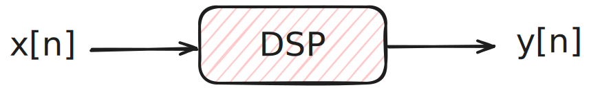

我們對差分方程式進行整理：

$$
\begin{aligned}
y[n] -2\cdot y[n-1] = 0.5\cdot x[n-1] \\
\therefore y[n] = 0.5\cdot x[n-1] + 2\cdot y[n-1]
\end{aligned}
$$

於是我們就能畫出：
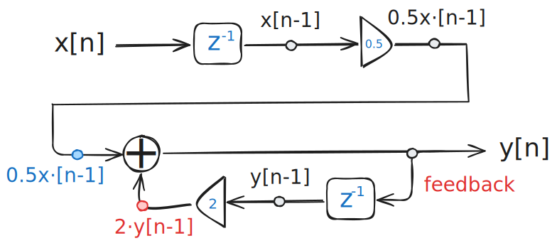

### 轉移函數

系統的轉移函數定義為輸出 $Y(z)$ 與輸入 $X(z)$ 的比值。承接上面的例子，首先對差分方程式進行 Z 轉換，根據上面證明的平移特性，我們可以很快的寫出：

$$
\begin{aligned}
y[n] -2\cdot y[n-1] &= 0.5\cdot x[n-1] \\
& \downarrow \text{ Z-Transform} \\
Y(z) -2\cdot z^{-1}\cdot Y(z) &= 0.5\cdot z^{-1}\cdot X(z) \\
\therefore Y(z) (1-2z^{-1}) &= 0.5\cdot z^{-1}\cdot X(z)
\end{aligned}
$$

這個轉移函數 $T(z)$ 是描述系統特性的核心，它決定了系統面對任何輸入時的反應：
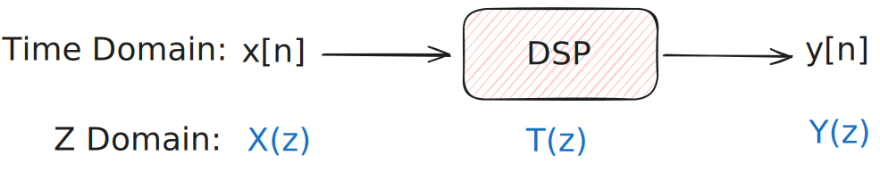

$$
{\color{#e53935}T(z)}\equiv\frac{Y(z)}{X(z)} = \frac{0.5\cdot z^{-1}}{1-2\cdot z^{-1}}
$$

只要有了 $T(z)$，我們就能輕鬆算出任何輸入對應的結果：$Y(z) = T(z)\cdot X(z)$

---

# 數位濾波器與 DSP 系統的頻率響應

Z 轉換出來的結果轉移函數 $T(z)$，是一個包含所有可能 $z$ 值的複數平面。這個平面通常可用來分析系統的「穩定性」，但它還不是我們直觀能看懂的物理頻率，因此這個章節重點在於如何從 Z 域轉換到頻域，並計算系統的增益與相位。

再複習一下這張圖，講 [Z 轉換](#z-轉換) 的時候出現過：

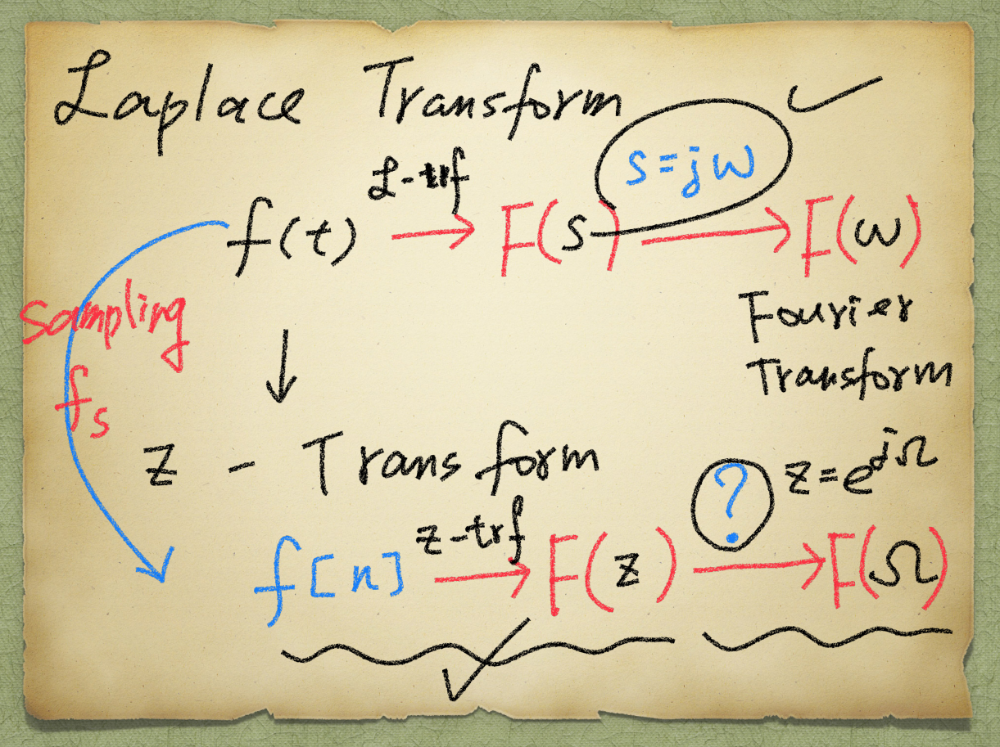

當初在 Z 域以及頻域之間的箭頭打了一顆星星，現在就要來提到這個部分，一樣拿連續時間系統跟離散時間系統做一個對照：

- **連續時間系統：** 拉普拉斯轉換（$s$ 域）$\rightarrow$ 鎖定虛數軸（$s = jw$）$\rightarrow$ 變成傅立葉轉換（頻域）
- **離散時間系統：** Z 轉換（$z$ 域）$\rightarrow$ 鎖定單位圓（$z = e^{j\Omega}$）$\rightarrow$ 變成離散時間傅立葉轉換（頻域）

### 為什麼 $z = e^{j\Omega}$？

$$
\begin{aligned}
x(t-T) \xrightarrow{\mathcal{L}\text{-trf}} \mathcal{L}\{x(t-T)\} &= {\color{#e53935}e^{-sT}}\cdot X(s) \\
x[nT-T] \xrightarrow{\text{z-trf}} Z\{x[n-1]\} &= {\color{#e53935}z^{-1}}\cdot X(z) \\
z^{-1} = e^{-sT} = (e^{sT})^{-1} \text{ } & \therefore z = e^{sT} \\
\because s = j\omega \Rightarrow \text{Frequency} & \text{ response} \\
\therefore z = e^{{\color{#3071c4}j\omega} T} = e^{j{\color{#3071c4}\Omega}}
\end{aligned}
$$

## 系統的頻率響應分析

### 振幅響應與增益 (Magnitude Response / Gain)

- 系統的增益即為轉移函數在 $z = e^{j\Omega}$ 時的絕對值大小：$\text{Gain} = |T(z)|_{z=e^{j\Omega}}$
- 若要以分貝表示，公式為：$\text{Gain}_{\text{dB}} = 20\cdot\log(|T(z)|_{z=e^{j\Omega}})$
- 可利用尤拉公式 (Euler formula) $e^{j\Omega} = \cos(\Omega) + j\sin(\Omega)$ 將數值代入轉移函數，計算特定頻率下的增益

:::tip[Remark: Euler Formula]
$$
\begin{aligned}
e^{j\theta} &= \cos(\theta) + j\sin(\theta), \quad j = \sqrt{-1} \\
\therefore z = e^{j\Omega} &= \cos(\Omega) + j\sin(\Omega)
\end{aligned}
$$
代入轉移函數後會得到一個複數 $T(e^{j\Omega}) = a + jb$，其絕對值（也就是增益）算法為：
$$|T(e^{j\Omega})| = \sqrt{a^2 + b^2}$$
:::

### 相位響應 (Phase Response)

除了振幅（增益）會改變之外，訊號經過系統後，波形的「相位」也會產生偏移。
將 $z = e^{j\Omega}$ 代入轉移函數後得到的複數 $a + jb$，我們也可以求出它的角度，這個角度就是相位的變化量 $\phi$：

$$
\phi = \tan^{-1}\left(\frac{b}{a}\right) = \tan^{-1}\left(\frac{\text{虛部 Im}}{\text{實部 Re}}\right)
$$

### 極點與零點 (Poles & Zeros)

轉移函數 $T(z)$ 通常可以表示成一個帶有分子跟分母的有理函數 (Rational function)：
$$T(z) = \frac{Y(z)}{X(z)} = \frac{N(z)}{D(z)}$$

- **零點 (Zeros)：** 讓分子 $N(z) = 0$ 的 $z$ 值。在這些特定的 $z$ 值下，系統的輸出為 0（增益為 0），代表這些頻率的訊號會被完全阻擋。
- **極點 (Poles)：** 讓分母 $D(z) = 0$ 的 $z$ 值。在這些特定的 $z$ 值下，系統增益會趨近於無限大，極點的位置對於判斷一個系統是否「穩定」非常關鍵。

## 範例與練習

Determine the gain in dB at 2 rad/s and 37 rad/s for the digital fitter with the following transfer function with the sampling period $T = 0.02\text{s}$. Also state if it is a highpass or lowpass filter. $T(z) = \frac{0.8333(z-1)}{z-0.667}$.

:::note[ANS]
**Step 1. 先把公式準備好**

將尤拉公式 $z = e^{j\Omega} = \cos(\Omega) + j\sin(\Omega)$ 代入轉移函數：
$$
T(e^{j\Omega}) = \frac{0.8333(\cos\Omega - 1 + j\sin\Omega)}{(\cos\Omega - 0.667) + j\sin\Omega}
$$
接著我們要算增益的絕對值（分子分母分別取絕對值 $\sqrt{\text{實部}^2 + \text{虛部}^2}$）：
$$
|T(e^{j\Omega})| = \frac{0.8333 \cdot \sqrt{(\cos\Omega - 1)^2 + (\sin\Omega)^2}}{\sqrt{(\cos\Omega - 0.667)^2 + (\sin\Omega)^2}}
$$

分子根號內展開：$\cos^2\Omega - 2\cos\Omega + 1 + \sin^2\Omega = 2 - 2\cos\Omega$  
分母根號內展開：$\cos^2\Omega - 1.334\cos\Omega + 0.444889 + \sin^2\Omega = 1.444889 - 1.334\cos\Omega$

**Step 2. 代入 $\omega = 2\text{ rad/s}$**
- $\Omega = \omega T = 2 \times 0.02 = 0.04\text{ rad}$
- $\cos(0.04) \approx 0.9992$
- 代入剛剛整理好的絕對值公式：
  - 分子：$0.8333 \times \sqrt{2 - 2(0.9992)} = 0.8333 \times \sqrt{0.0016} = 0.8333 \times 0.04 \approx 0.0333$
  - 分母：$\sqrt{1.444889 - 1.334(0.9992)} = \sqrt{1.444889 - 1.3329} \approx \sqrt{0.1119} \approx 0.3345$
  - $\text{Gain} = \frac{0.0333}{0.3345} \approx 0.0995$
- 換算 dB：$20\log_{10}(0.0995) \approx \mathbf{-20.04\text{ dB}}$（增益大幅衰減！）

**Step 3. 代入 $\omega = 37\text{ rad/s}$**
- $\Omega = \omega T = 37 \times 0.02 = 0.74\text{ rad}$
- $\cos(0.74) \approx 0.7385$
- 代入絕對值公式：
  - 分子：$0.8333 \times \sqrt{2 - 2(0.7385)} = 0.8333 \times \sqrt{0.523} \approx 0.8333 \times 0.7232 \approx 0.6026$
  - 分母：$\sqrt{1.444889 - 1.334(0.7385)} = \sqrt{1.444889 - 0.9851} \approx \sqrt{0.4597} \approx 0.6780$
  - $\text{Gain} = \frac{0.6026}{0.6780} \approx 0.8888$
- 換算 dB：$20\log_{10}(0.8888) \approx \mathbf{-1.02\text{ dB}}$（接近 0 dB，訊號無損通過！）

**Step 4. 判斷濾波器類型**
根據上面的計算：
- 低頻率 ($\omega = 2$) 時，訊號衰減很嚴重 (-20 dB)
- 高頻率 ($\omega = 37$) 時，訊號順利通過 (-1 dB)
- 結論：這是一個高通濾波器
:::

---

# IIR 濾波器設計

前面介紹了數位濾波器的規格以及 Z 轉換如何幫助我們在頻域進行分析，接下來就要進入重頭戲了：如何實際設計出一個濾波器！我們首先從 IIR 濾波器開始談起。

## 系統與差分方程式

複習一下，在 DSP 系統中，輸入訊號 $x[n]$ 經過系統 $T$ 轉換後會得到輸出 $y[n]$，我們可以將其表示為 $y[n]=T(x[n])$。
常見的系統運算包含了：
- **延遲系統 (Delay System)：** 輸出直接是過去輸入的延遲，表示為 $y[n]=x[n-d]$
- **移動平均系統 (Moving-Average System)：** 輸出是過去幾個輸入訊號的平均，例如三階的移動平均可以寫成 $y[n]=\frac{1}{3}(x[n]+x[n-1]+x[n-2])$

如果我們把這些概念推廣，系統的輸出其實可以由「過去的輸出」與「現在及過去的輸入」組合而成，形成了**一般差分方程式** (General Difference Equation)，公式如下：

$$
y[n]=a_{1}y[n-1]+a_{2}y[n-2]+\dots+a_{p}y[n-p] + b_{0}x[n]+b_{1}x[n-1]+\dots+b_{q}x[n-q]
$$

$p$ 和 $q$ 分別代表回饋 (Feedback, 過去的輸出) 與前饋 (Feedfoward, 現在與過去的輸入) 的階數。

### 轉移函數 (Transfer Function)

在時域看這長長一串方程式有點痛苦，所以我們把它丟進 Z 轉換的魔法陣裡。利用上一章提到的平移特性（$x[n-k] \xrightarrow{\mathcal{Z}} z^{-k}X(z)$），我們可以把差分方程式整理成系統的轉移函數 $H(z)$：

$$
\begin{aligned}
Y(z) &= a_{1}z^{-1}Y(z) + a_{2}z^{-2}Y(z) + \dots + a_{p}z^{-p}Y(z) \\
     &\quad + b_{0}X(z) + b_{1}z^{-1}X(z) + \dots + b_{q}z^{-q}X(z)
\end{aligned}
$$

經過移項與提出公因數後，我們就能得到系統的轉移函數 $H(z)$：

$$
H(z) = \frac{Y(z)}{X(z)} = \frac{b_{0}+b_{1}z^{-1}+b_{2}z^{-2}+\dots+b_{q}z^{-q}}{1-a_{1}z^{-1}-a_{2}z^{-2}-\dots-a_{p}z^{-p}}
$$

:::note
這裡的 $H(z)$ 跟前面提到的 $T(z)$ 基本上是同一個東西，其實在 DSP 中用 $H(z)$ 應該是比較普遍的，之後不管看到 $T(z)$ 還是 $H(z)$ 都要知道是在說轉移函數（系統函數）。
:::

## FIR 與 IIR 濾波器

根據差分方程式中是否含有「過去的輸出（即 Feedback）」，我們可以將數位濾波器分為兩大家族：

1. **FIR（Finite Impulse Response, 有限脈衝響應）：**
   - 系統中**沒有回饋 (No feedback)**
   - 也就是差分方程式中的係數 $a_{1}=a_{2}=\dots=a_{p}=0$
2. **IIR（Infinite Impulse Response, 無限脈衝響應）：**
   - 系統中**具有回饋 (has feedback)**
   - 代表 $a_{1} \neq 0$ 或是 $a_{2} \neq 0$ $\dots$ $a_{k} \neq 0$ 等，這會導致脈衝響應在理論上會無限延伸下去

## 四大基本類比濾波器

要無中生有設計出一個數位 IIR 濾波器有點難，所以工程界習慣先參考已經發展非常成熟的「類比濾波器」，再將其轉換成數位濾波器。最經典的有以下四種：

1. Butterworth Filter
    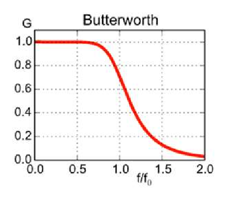
2. Chebyshev Type I Filter
    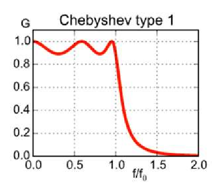
3. Chebyshev Type II Filter (Inverse Chebyshev Filter)
    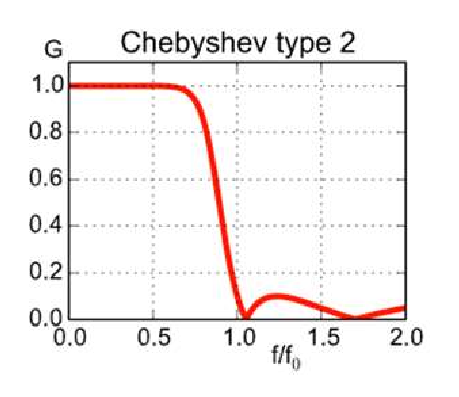
4. Elliptic Filter (Cauer Filter)
    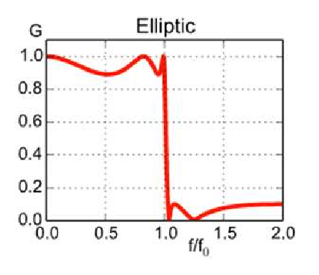

<small>🔗圖片來源：https://pages.hmc.edu/mspencer/e157/fa24/slides/09.pdf</small>

各種數位濾波器的特色如下表所示：

| 濾波器 | 通帶 | 阻帶 | 過渡帶斜率 | Ripple 位置 | 階數需求 | 設計難度 | 適用情境 |
| :--- | :--- | :--- | :--- | :--- | :--- | :--- | :--- |
| **Butterworth** | 完全平坦 | 單調下降 | 最慢 | 無 | 高 | 最簡單 | 音訊、量測 |
| **Chebyshev I** | 有 ripple | 單調下降 | 較快 | 通帶 | 較低 | 中等 | 通訊 |
| **Chebyshev II** | 平坦 | 有 ripple | 較快 | 阻帶 | 較低 | 中等 | 精準通帶 |
| **Elliptic** | 有 ripple | 有 ripple | 最快 | 通帶/阻帶 | 最低 | 最複雜 | 高效率頻譜 |

## IIR 濾波器設計：脈衝不變法

了解了類比濾波器後，我們如何把它「轉」成數位濾波器呢？這裡介紹一種最直觀的方法：**脈衝不變法** (Impulse Invariant Method)。

它的核心概念非常簡單粗暴：我們希望設計出來的數位濾波器，它的脈衝響應剛好等於類比濾波器脈衝響應在離散時間下的取樣點！

- 在類比系統中：若輸入為脈衝訊號 $\delta(t)$（對應拉普拉斯轉換 $X(s)=1$），則系統輸出 $Y(s) = T(s)$。
- 在數位系統中：若輸入為脈衝序列 $\delta[n]$（對應 Z 轉換 $X(z)=1$），則系統輸出 $Y(z) = T(z)$。
- 數學關係：$T(z) = \mathcal{Z}\left\{ \left. \mathcal{L}^{-1}[T(s)] \right|_{t=nT} \right\}$

### 舉個栗子|⩊･)ﾉ🌰

假設我們已知一個一階類比低通濾波器（直流增益為 1，截止頻率 $\omega_c = 10\text{ rad/s}$），其轉移函數為 $T(s) = \frac{10}{s+10}$。
現在我們想要使用脈衝不變法來找它的數位濾波器差分方程式，假設取樣週期 $T = 0.1\text{s}$。

**Step 1. 求出連續時間脈衝響應**  
對 $T(s)$ 取反拉普拉斯轉換：
$$
y(t) = \mathcal{L}^{-1}\left[\frac{10}{s+10}\right] = 10 \cdot e^{-10t}
$$

**Step 2. 代入離散時間進行取樣**  
將 $t = nT = 0.1n$ 代入上述方程式：
$$
y[n] = \left. 10 \cdot e^{-10t} \right|_{t=0.1n} = 10 \cdot e^{-10(0.1n)} = 10 \cdot e^{-n}
$$

**Step 3. 進行 Z 轉換**  
將取樣後的 $y[n]$ 進行 Z 轉換求出 $Y(z)$：
$$
Y(z) = \mathcal{Z}\{10 \cdot e^{-n}\} = \frac{10z}{z-e^{-1}}
$$

**Step 4. 進行增益補償並求出 $H(z)$**
為了補償取樣過程中產生的 $1/T$ 倍頻譜放大效應，須將 Z 轉換結果乘上取樣週期 $T$ 以校正增益，使其與原類比濾波器量級一致：
$$
H(z) = T \cdot Y(z) = 0.1 \cdot \frac{10z}{z-e^{-1}} = \frac{1}{1-e^{-1}z^{-1}}
$$

:::tip[為什麼要乘上取樣週期 $T$？]
如果不做增益補償，系統會怎麼樣？我們實際拿上面這個例子算一下「直流增益」（也就是頻率為 0 時的倍率，代入 $s=0$ 或 $z=1$）：

- **原本的類比濾波器：** $T(s) = \frac{10}{0+10} = 1$ （訊號 1 倍無損通過）
- **未乘 T 補償的數位濾波器：** $Y(z) = \frac{10}{1-e^{-1}} \approx 15.8$ （訊號直接被暴增近 16 倍，系統大爆走）
- **乘上 $T\ (0.1)$ 補償後：** $H(z) = \frac{10}{1-e^{-1}} \cdot 0.1 \approx 1.58$

雖然脈衝不變法因為天生的「高頻混疊」缺陷，導致補償後無法完美回到 1，但至少乘上 $T$ 後，已經把增益量級拉回正確的基準線了！
:::

**Step 5. 轉回差分方程式**  
有了轉移函數，我們將其還原為輸入與輸出的關係：
$$
\begin{gather*}
\frac{Y(z)}{X(z)} = \frac{1}{1-e^{-1}z^{-1}} \\
Y(z) \cdot (1-e^{-1}z^{-1}) = X(z) \\
Y(z) - e^{-1}z^{-1}Y(z) = X(z)
\end{gather*}
$$

最後反 Z 轉換回時域，大功告成！這就是我們要的 IIR 濾波器：
$$
y[n] - e^{-1}y[n-1] = x[n] \quad \Rightarrow \quad {\color{#3071c4}y[n] = e^{-1}y[n-1] + x[n]}
$$

_✍️TODO：圖之後補_

_未完待續..._

:::note
部份圖片來源自：陳榮銘 教授 數位訊號處理課程投影片
:::
