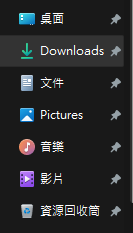
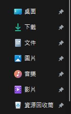
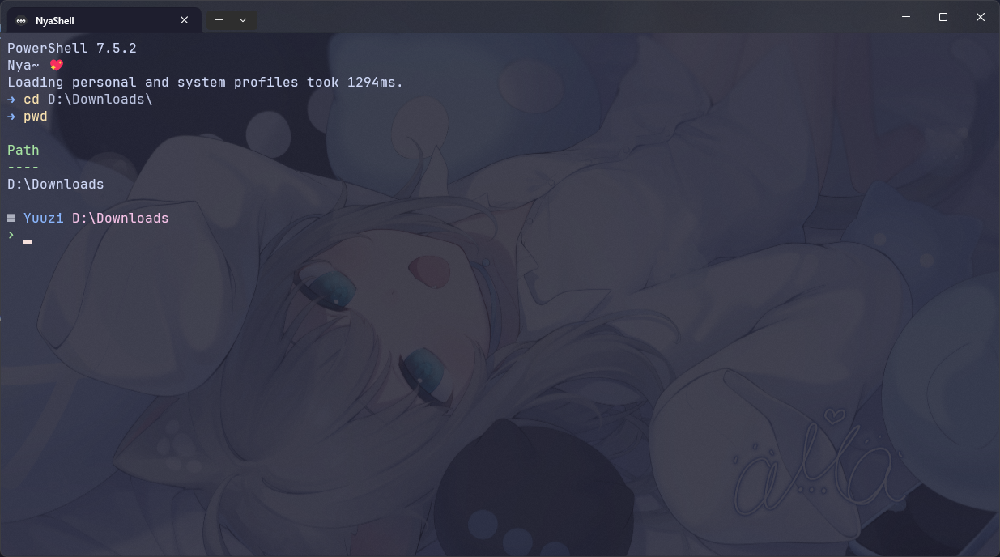

## 前言

昨天發現C槽的讀寫次數大約是D槽的2倍，為了讓我的系統碟更長壽一點，我決定把下載跟圖片的預設路徑改到D槽，分擔下載以及截圖的工作來平衡一下看看。然後我就想說既然以前預設的資料夾也不是叫「下載」跟「圖片」，這種系統級的資料夾應該會幫我自動處理好本地化對吧？結果重新開機後「下載」跟「圖片」就變成「Downloads」跟「Pictures」了（新路徑我自定義的資料夾名稱），你可能會說那就把新路徑的資料夾改成中文不就好了？No～No～No～，這樣太不優雅了，肯定是想個辦法把本地化搞回來！



## 查看 desktop.ini 的內容

查了一下資料後發現應該是 `desktop.ini` 這個系統級檔案在控制本地化之類的行為，於是我看了一下我下載資料夾的 `desktop.ini` 檔案，嗯～只有指定了icon，這是我昨天透過 GUI 設置的，讓資料夾一目了然這是下載資料夾，顯然我沒有配置本地化的資訊：

```ini title="D:\Downloads\desktop.ini"
[.ShellClassInfo]
IconResource=C:\Windows\System32\imageres.dll,175
[ViewState]
Mode=
Vid=
FolderType=Generic
```

於是我參考了一下[這篇文章](https://superuser.com/questions/1172765/how-do-i-restore-the-localized-name-for-documents-folder-windows-10)，它整理了 Windows 常見資料夾的的字串資源 ID，雖然文章很舊了但我實測有效，下載的 ID 是 `-21798`，因此對 `desktop.ini` 進行以下修改：

```ini title="D:\Downloads\desktop.ini" ins={2}
[.ShellClassInfo]
LocalizedResourceName=@%SystemRoot%\system32\shell32.dll,-21798
IconResource=C:\Windows\System32\imageres.dll,175
[ViewState]
Mode=
Vid=
FolderType=Generic
```

順便整理一下這些常見資料集的 ID 列表：

| 中文名稱 | 英文名稱 | 資源識別字串 |
| :--- | :--- | :--- |
| 資源回收筒 | Recycle Bin | `@%SystemRoot%\system32\shell32.dll,-8964` |
| 連絡人 | Contacts | `@%CommonProgramFiles%\system\wab32res.dll,-10100` |
| 桌面 | Desktop | `@%SystemRoot%\system32\shell32.dll,-21769` |
| 文件 | Documents | `@%SystemRoot%\system32\shell32.dll,-21770` |
| 下載 | Downloads | `@%SystemRoot%\system32\shell32.dll,-21798` |
| 我的最愛 | Favorites | `@%SystemRoot%\system32\shell32.dll,-21796` |
| 連結 | Links | `@%SystemRoot%\system32\shell32.dll,-21810` |
| 音樂 | Music | `@%SystemRoot%\system32\shell32.dll,-21790` |
| 圖片 | Pictures | `@%SystemRoot%\system32\shell32.dll,-21779` |
| 儲存的遊戲 | Saved Games | `@%SystemRoot%\system32\shell32.dll,-21814` |
| 搜尋 | Searches | `@%SystemRoot%\system32\shell32.dll,-9031` |
| 影片 | Videos | `@%SystemRoot%\system32\shell32.dll,-21791` |
| 公用桌面 | Public Desktop | `@%SystemRoot%\system32\shell32.dll,-21799` |
| 公用文件 | Public Documents | `@%SystemRoot%\system32\shell32.dll,-21801` |
| 公用下載 | Public Downloads | `@%SystemRoot%\system32\shell32.dll,-21808` |
| 公用音樂 | Public Music | `@%SystemRoot%\system32\shell32.dll,-21803` |
| 公用圖片 | Public Pictures | `@%SystemRoot%\system32\shell32.dll,-21802` |
| 公用影片 | Public Videos | `@%SystemRoot%\system32\shell32.dll,-21804` |

同理，圖片的 ID 是 `-21779`，順便照著文章把 InfoTip 補上，雖然不太重要ww

```ini title="D:\Pictures\desktop.ini" ins={2,3}
[.ShellClassInfo]
LocalizedResourceName=@%SystemRoot%\system32\shell32.dll,-21779
InfoTip=@%SystemRoot%\system32\shell32.dll,-12688
IconResource=C:\WINDOWS\System32\SHELL32.dll,127
[ViewState]
Mode=
Vid=
FolderType=Pictures
```

大功告成，將 `desktop.ini` 以 `ANSI` 或 `UTF-16 LE` 編碼儲存避免出問題，然後重新啟動後就能看到本地化回來囉！



這樣檔案總管可以看到本地化名稱，Terminal一樣可以看到資料夾的原始名稱，熟悉的味道回來了～


