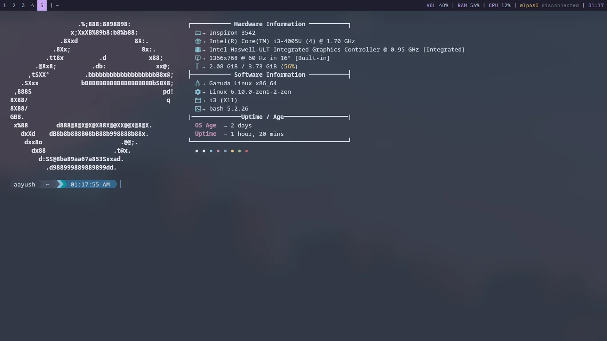
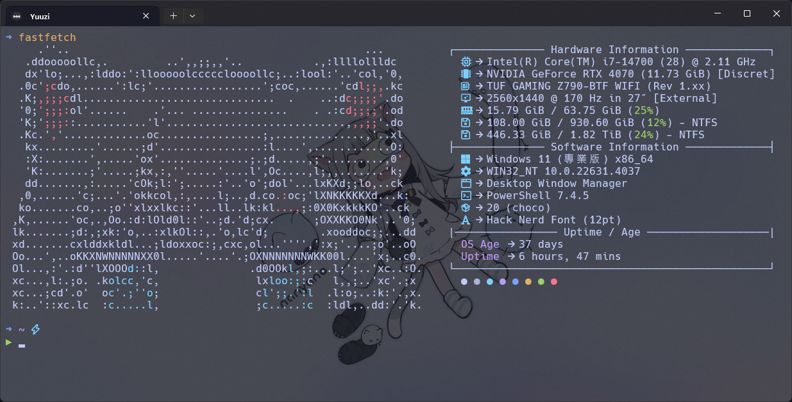

## 前言

雖然我上一篇才寫了一篇和 Neofetch 有關的文章，不過那其實是我以前寫然後搬來這裡的，最近跳槽到 Fastfetch 我覺得在 Windows 速度很可以啊，畢竟他是用 C 寫的，而 Neofetch 則是用 bash 實現的。這篇不會細講怎麼將 ASCII 藝術放入 Fastfetch，老實說我也還沒玩得很明白，暫且是透過 Python 腳本把以前用 jp2a 轉換的 ASCII 藝術改寫成 for Fastfetch 的，總之廢話不多說進入正題。

## 更新 (2024/10/15)

原作者把文給刪了，[所以這裡放上新的連結](https://www.reddit.com/r/GarudaLinux/comments/1dcq0dl/making_fastfetch_more_beautiful_linux/)，下面教學步驟的連結我也會一起換掉，如果比較喜歡作者原本的舊版，可以直接拉到最下面載我提供的版本來改。

## 安裝Fastfetch

安裝 Fastfetch 很簡單，從自己的 OS 選擇自己喜歡的方式，我簡單瀏覽過看起來方法並不少，Fastfetch 的 Repo 位址👇

::github{repo="fastfetch-cli/fastfetch"}

## 設定config

接下來就要設定 config 了，畢竟原版配置說不上醜，就是不夠優雅，不夠個性對吧，這裡我找到了一個[由 reddit 用戶 aayush-le 寫好的配置](https://www.reddit.com/r/GarudaLinux/comments/1dcq0dl/making_fastfetch_more_beautiful_linux/)，我覺得挺好看的，總之先照著他說的做，我這裡簡單翻譯成中文好了

1. 先到當前使用者的 `.config` 資料夾裡面 → `/home/<your_username>/.config`，如果沒找到就自己創一個
2. 如果在 `.config` 資料夾裡面沒有看到 `fastfetch` 資料夾，那就自己創一個 → `mkdir fastfetch`
3. 透過fastfetch提供的指令創建一個預設的config文件 → `fastfetch --gen-config`
4. 移除預設的config文件 → `rm fastfetch/config.jsonc`
5. 下載這個作著提供的config文件 → `wget https://raw.githubusercontent.com/xerolinux/xero-layan-git/main/Configs/Home/.config/fastfetch/config.jsonc`
6. 重新啟動你的終端機

這裡的指令都是 for Linux 的，當然 Windows 也基本兼容這些指令，如果沒有 `wget` 的話也可以試試 `curl`，都沒有的話就自己裝一下，其實方式百百種啦總之能下載下來到對的位置就 OK 了！經過這些步驟基本上在終端機輸入 `fastfetch` 應該已經會有像是這樣的畫面了，借用原作者的圖，接下來就可以再依照自己的喜好客製化囉：

## 為 Windows 做一些修改

如果你和我一樣是 Windows 用戶，你會看到有一些些不對勁，第一眼就是作業系統那一欄是 Linux 的圖標，不過這也很正常，畢竟這些圖標都是硬編碼的，我們只要自己改就好了，以下是我做了一些修改後的簡單 Demo：

雖然原作者第一欄我不知道為什麼 Windows 沒辦法顯示，也可能是我這裡的問題，畢竟只要沒有值就不會顯示。我主要修改了 Linux 的圖標為 Windows 的，然後添加了一些原本沒有的欄位，每個欄位不喜歡的話註解掉就可以了，再來就是修復了 OS Age 的欄位，因為那欄是用 bash 指令寫的，Powershell 想當然而沒辦法跑，於是我改成了 Powershell 的指令，不過這個欄位畢竟是用指令跑的，多少會影響性能，如果很介意多等約1秒才能看到結果的話也可以自行移除，下面我就放上我修改的 config 文件供大家參考。

[📄文件連結](https://gist.github.com/Yuuzi261/7cea2f8fdd9a46e2b5651b1de44355ad)
