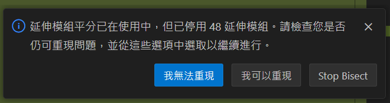
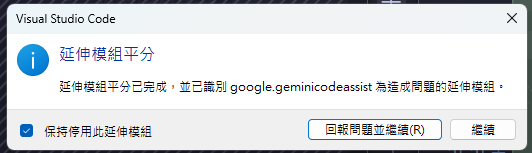
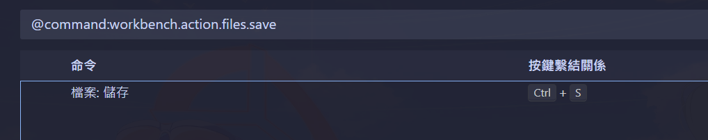
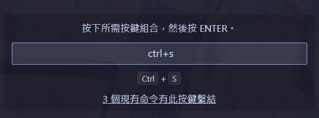
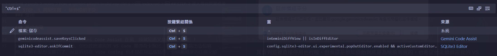
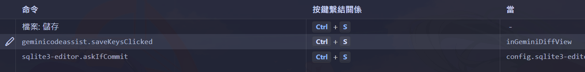

## 前言

最近突然發現在 Git 差異檢視介面修改 code 的時候，一直無法透過 <kbd>Ctrl</kbd> + <kbd>S</kbd> 進行儲存，變成都要切回檔案才能儲存。因為我習慣在這個界面最終確認目前的改動是否可以提交或暫存，往往會在檢查的過程中看到有些瑕疵要進行修改，結果這個小問題真的讓我快要抓狂，問了 LLMs 叫他們幫我查一下 VS Code 最近有沒有對塊進行改動，也沒查出一個所以然，用關鍵字搜了幾篇文章感覺跟我的狀況也都沒關係，只好自己來除錯了！！順便分享 VS Code 工作不如預期的時候我通常怎麼解決的～

## STEP. 1 萬能法寶 - 延伸模組平分

這個功能非常好用，根本是抓內鬼神器！簡單來說它就是透過二分搜的概念，一直切成兩等份然後問你錯誤是否能復現，照著回答就能迅速幫你抓出內鬼的延伸模組：

### 呼叫方式

1. <kbd>Ctrl</kbd> + <kbd>Shift</kbd> + <kbd>P</kbd>
2. 輸入 `bisect`
3. 點擊 `Help: Start Extension Bisect`

### 使用

然後就會跳出這個對話框，照著測試並回答就行了：

### 抓出內鬼

透過這個功能我迅速的抓到是 Gemini Code Assist 在搞，我就知道又是你，你最爛！！

好啦其實這個插件曾經好用過，但也曾經讓我的 VS Code 變得奇卡無比，現在又給我搞出這個麻煩，已經有點想蛋雕它了，反正我現在 Vibe Coding 也不是在用這個插件，但偶爾簡單的任務交給它做又還挺方便的，實在有點食之無味，棄之可惜啊...

其實到這裡直接停用也行啦，但我還是想知道他到底是為啥搞到我的，也希望他能繼續跟我的 VS Code 友好相處。

## STEP. 2 深入尋找問題根源

其實我上面說問 LLMs 的事也不是完全沒收穫，至少它告訴了我快捷鍵綁定的界面怎麼叫出來，總之一樣先 <kbd>Ctrl</kbd> + <kbd>Shift</kbd> + <kbd>P</kbd>，然後輸入 `workbench.action.files.save` 就能直接叫出「鍵盤快速鍵」界面並且自動搜尋上面這個關鍵字，馬上就能找到 VS Code 存檔的快捷鍵設定：

這個時候其實可以直接在搜尋欄搜尋 `"Ctrl + S"` 之類的也行，但我誤打誤撞找到另一種方法：先假裝要改設定，接著按 <kbd>Ctrl</kbd> + <kbd>S</kbd> 就會出現下面這個連結「n 個現有命令有此按鍵繫結」：

點擊它就能展示所有剛好是配置 <kbd>Ctrl</kbd> + <kbd>S</kbd> 的快捷設定：

此時眼尖的你一定發現貓膩了！Gemini Code Assist 有個不知道來幹啥的功能也是綁定 <kbd>Ctrl</kbd> + <kbd>S</kbd>，而且觸發條件是 `inGeminiDiffView || isInDiffEditor`，這代表只要一進到 Git 差異檢視介面這條件一定是 `True` 的，非常無恥( •́ὤ•̀)，那接下來不外乎就是兩個選擇...

### 選擇1：改快捷鍵

簡單暴力，直接明瞭，改掉這個衝突的快捷鍵設定基本上沒啥缺點，除了我可能會忘記這個新設的快捷鍵導致整個功能廢掉以外，不過我連這個功能是幹嘛的都不是很清楚，畢竟我使用這個插件非常的輕度，感覺就是要偵測使用者是不是按儲存之類的，然後進行下一步動作（我猜，總之我不是用這個方法

### 選擇2：改條件

我想到既然我習慣在 Git 差異檢視介面按 <kbd>Ctrl</kbd> + <kbd>S</kbd> 來儲存變更，那我就把這部份改回去就好了啊～原本的條件是 `inGeminiDiffView || isInDiffEditor`，那 `inGeminiDiffView` 的部分我就留著給它，到時候按 <kbd>Ctrl</kbd> + <kbd>S</kbd> 也直覺，但 `isInDiffEditor` 的部分就不準給我改行為，所以我直接把 OR 後面都拿掉，這樣在一般的 Git 差異檢視介面就不會被這個插件的快捷鍵設定干擾了！

## 問題解決

果不其然，當我修改完這個條件後，VS Code 又回到我認識的樣子了，非常感動！話說雖然這個問題除錯起來不算複雜，但要是不知道有這些相關的功能或設定的話，除錯起來可能還真的挺惡夢的，還好我知道「延伸模組平分」這個功能，否則一個一個把延伸模組給停用是真的太費手了ww

總之就先分享到這啦，遇到這個白癡問題又讓我水了一篇，感覺會有這個問題的人應該也不會太多吧哈哈，就看看能不能幫到剛好看到這篇文章的人囉～
