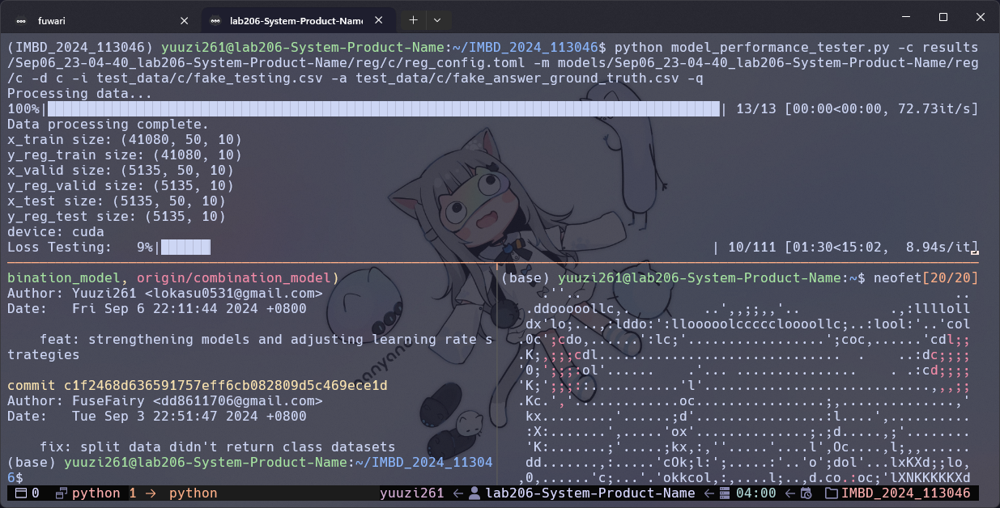

## 前言

最近又看不下去實驗室電腦的原生 tmux / oh my tmux 主題了，不夠可愛的東西很難一直用下去，但之前遇到太多主題都有字體顯示不出來的問題，明明 [Nerd Font](https://www.nerdfonts.com/) 都裝了，也不知道是實驗室的電腦真的有什麼問題還是這就是用 powershell 連線過去的原罪，廢話太多了總之這次我盡可能的找到了比較順眼、顯示也比較沒 bug 的主題開搞。

## 安裝 tmux & oh my tmux

### tmux

畢竟是 Linux 的東西，果然又是套件管理工具出場了，這裡就以我實驗室電腦的 `Ubuntu` 為例

```bash
sudo apt install tmux
```

其他不同的 Linux 自行 Google 吧，既然都在玩 Linux 了這點事應該是小事一樁，安裝好後輸入 `tmux` 執行，底部應該會有一條綠色的狀態列，這裡不展開細說 tmux 的具體用法，離題了。

### oh my tmux

安裝 oh my tmux 的步驟都在儲存庫的 README 了：

::github{repo="gpakosz/.tmux"}

`Requirements` 那個欄位要特別注意，該有的都要有，然後如果有既有的設定檔記得備份，不要像我一樣勇往直前。安裝路徑有三個地方可以選，選自己喜歡的，這裡以根目錄為例，想安裝到其他地方就去 README 看：

```bash
cd
git clone https://github.com/gpakosz/.tmux.git
ln -s -f .tmux/.tmux.conf
cp .tmux/.tmux.conf.local .
```

這樣就安裝好了，可以開始來設定 oh my tmux。

## 設定 oh my tmux

:::caution
雖然 README 也有說但這裡特別提一下，所有設定檔的更改請在 `tmux.conf.local` 或 `.tmux.conf.local` 進行，不要動 `tmux.conf` 或 `.tmux.conf`，不然接下來你就只能靠你自己的聰明才智 debug 了！
:::

接下來就修改 `tmux.conf.local` 或 `.tmux.conf.local` 來啟用自己喜歡的插件吧，因為我對 tmux 也不是說很熟，如果你也對 tmux 不熟的話我會建議啟用這個插件，它大致有以下這些功能：

- 使用滑鼠滾輪查看歷史紀錄
- 快速複製終端機內文字
- 使用滑鼠調整分割頁面


右鍵可以叫出上圖的選單，常用的功能都在上面了，基本使用上可以大幅減少打指令的機會，對於 tmux 小白來說一瞬間可以少記好幾條指令，超級方便，有兩種方式可以啟用，我推薦第二種一勞永逸。

### 第一種方法

使用前綴指令 `ctrl + b` 或是 `ctrl + a`，接下來輸入 `:`，進入指令模式，接著輸入：

```bash
:setw -g mouse on
```

這樣就完成了，不過每次重啟都要重新輸入很不方便，直接寫進設定檔吧！

### 第二種方法

編輯 `tmux.conf.local` 或 `.tmux.conf.local` 檔案，裡面應該已經幫你寫好了，找到 `set -g mouse on` 這行直接取消註解就OK了，如果沒有就自己加上。

當然還有很多實用插件可以自由摸索，選擇自己需要的，我這裡就不多做介紹，畢竟我這次不是不滿意使用體驗，而是不滿意顏值啊！

## 更換 oh my tmux 的主題

終於進入正題了，這裡先列出一些我覺得還不錯看的主題：

- nordtheme
::github{repo="nordtheme/tmux"}
- tokyo-night-tmux
::github{repo="janoamaral/tokyo-night-tmux"}
- rose-pine
::github{repo="rose-pine/tmux"}

這次我安裝的是 `rose-pine`，不是因為我覺得它最好看，只是剛好這個主題對實驗室電腦來說比較沒 bug，然後套了我的 Windows Terminal 主題後視覺上沒有太大影響而採用，以後我應該還是去玩一下 WSL 或是灌個 Arch 來玩玩吧，最近看到很多 Arch rice 的影片有燒到我。

雖然每個主題有些微差異，但不外乎基本支援透過 [TPM](https://github.com/tmux-plugins/tpm) 這個 tmux 插件管理工具來安裝，不過有些主題雖然也是透過 `TPM` 安裝，但會跟 oh my tmux 衝突，要特別注意一下，對我就是在說你 [Catppuccin](https://github.com/catppuccin/tmux)！

### 安裝TPM

安裝 TPM 其實也蠻簡單的，第一步先把整個儲存庫 clone 下來：

```bash
git clone https://github.com/tmux-plugins/tpm ~/.tmux/plugins/tpm
```

接著一樣編輯 `tmux.conf.local` 或 `.tmux.conf.local`，把下面這些指令放到設定檔的最下面。

```bash
# List of plugins
set -g @plugin 'tmux-plugins/tpm'
set -g @plugin 'tmux-plugins/tmux-sensible'

# Other examples:
# set -g @plugin 'github_username/plugin_name'
# set -g @plugin 'github_username/plugin_name#branch'
# set -g @plugin 'git@github.com:user/plugin'
# set -g @plugin 'git@bitbucket.com:user/plugin'

# Initialize TMUX plugin manager (keep this line at the very bottom of tmux.conf)
run '~/.tmux/plugins/tpm/tpm'
```

:::important
這裡注意，不管以後加了什麼插件，這些東西都要保持在最底部，尤其是 `run '~/.tmux/plugins/tpm/tpm'` 這行絕對要是最後一行！
:::

然後重新載入 tmux 的設定

```bash
# type this in terminal if tmux is already running
tmux source ~/.tmux.conf
```

如果剛好沒有 tmux 在執行也可以直接殺掉 tmux server，很多時候莫名奇妙沒有套用都是重新啟動就好了，重新啟動可以解決99%的問題（X

```bash
tmux kill-server
```

這樣一來就安裝好了，TPM 有3種特殊指令可以用：

`prefix` + <kbd>I</kbd>
- 從任何 git 儲存庫安裝新插件
- 刷新 tmux 環境

`prefix` + <kbd>U</kbd>
- 更新插件

`prefix` + <kbd>alt</kbd> + <kbd>u</kbd>
- 刪除/解除安裝不在插件清單中的插件

### 透過 TPM 安裝 tmux 主題

有了 TPM 安裝主題就會變得超級簡單，通常只要遵循該主題作者提供的設定檔複製貼上到 `tmux.conf.local` 或 `.tmux.conf.local`，然後透過上面介紹的 TPM 指令操作一下就可以了，以我這次安裝的 `rose-pine` 為例：

```bash
set -g @plugin 'rose-pine/tmux'
# ... alongside
set -g @plugin 'tmux-plugins/tpm'
# To update plugin for future revisions or bug fixes, do the "Prefix + U" keycombo
```

一行就搞定安裝了，不過接下來的設定稍微比較麻煩一點，不同作者也是看心情寫註解，有時候不自己試試看也不知道那些設定具體是在幹麻，就只能看著 README 或文檔摸索，如果你也跟我一樣用 `rose-pine` 的話，我這裡有我調整過的設定檔可以參考，再依照自己的喜好調整一下應該會比重頭來快一點點：

```bash
set -g @plugin 'rose-pine/tmux'
set -g @rose_pine_variant 'main'

set -g @rose_pine_host 'on' # Enables hostname in the status bar
set -g @rose_pine_date_time '%H:%M' # It accepts the date UNIX command format (man date for info)
set -g @rose_pine_user 'on' # Turn on the username component in the statusbar
set -g @rose_pine_directory 'on' # Turn on the current folder component in the status bar

set -g @rose_pine_window_separator '   ' # Replaces the default `:` between the window number and name
```

效果大概如下：



總之這次就是簡單調整一下底部的狀態列，比原生的 tmux 一整條綠色或是 oh my tmux 預設那誇張鮮豔的配色來的好上不少，當然這絕對不是我最滿意的樣子，不過畢竟就實驗室電腦，也不用培養太多感情，至少現在看著它已經順眼不少！
