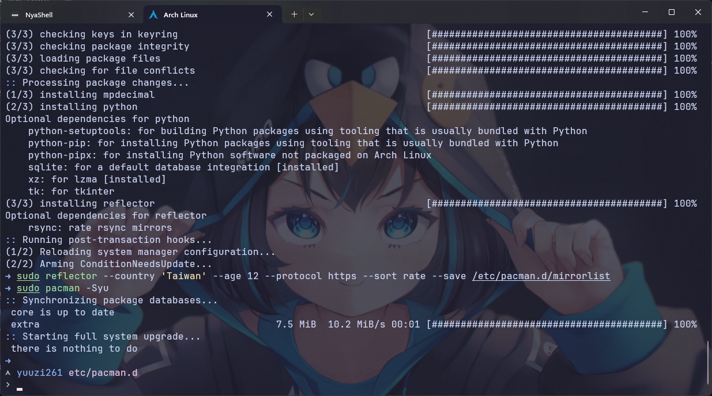

## 前言

今天早上打開 Arch WSL 看一下，隨手更新一下軟體，欸？怎麼就報錯了，昨天還有夢到用 `pacman` 時出錯，雖然跟夢境的報錯不一樣，但這果然是預知夢嗎，太黑暗了...總之，我還蠻幸運的很快就解決了，沒有用到太多奇怪的技巧。

## 報錯

例行更新環節，想到就更新一下結果報錯：

```bash
➜ sudo pacman -Syu
```

```bash
:: Synchronizing package databases...
 core is up to date
 extra.db failed to download
error: failed retrieving file 'extra.db' from mirrors.kernel.org : The requested URL returned error: 404
error: failed to synchronize all databases (failed to retrieve some files)
```

嘗試清理緩存那些的，但沒有用：

```bash
sudo pacman -Sc
sudo pacman -Scc
```

使用 `debug flag` 來查看更詳細的問題:

```bash
sudo pacman -Syu --debug
```

主要印出這些問題，有些 info 我就省略了太長

```bash
...
debug: adding new server URL to database 'extra': https://mirrors.kernel.org/archlinux/extra/os/x86_64
...
debug: extra.db: curl returned result 0 from transfer
debug: extra.db: response code 404
error: failed retrieving file 'extra.db' from mirrors.kernel.org : The requested URL returned error: 404
...
```

這樣看起來，嘗試從 `mirrors.kernel.org` 下載 `extra.db` 時出遇到 HTTP 404 錯誤，請求的資源不存在，這在加上 debug flag 之前就大概看出端倪了。

這種情況大概是以下這幾種可能：

- 靜像站暫時故障
- 靜像站正在同步中
- 靜像站路徑變更了
- 本地的靜像列表過期

## 解決方法

既然推測如此，那就先用最簡單的方式，更新一下靜像站的列表試試，先備份本來的列表避免出問題，然後更新 mirrorlist：

:::note[沒有 `reflector` 套件的話要先安裝]

```bash
sudo pacman -S reflector
```

:::

```bash
# 備份現有的 mirrorlist
sudo cp /etc/pacman.d/mirrorlist /etc/pacman.d/mirrorlist.backup

# 更新 mirrorlist
sudo reflector --country '<country>' --age 12 --protocol https --sort rate --save /etc/pacman.d/mirrorlist
```

`<country>` 的部分自己替換成自己所在的國家，這裡的意思大概是，指定位於特定國家的靜像站，選擇最近 12 小時內同步過的鏡像站，只選擇支持 HTTPS 協議的鏡像站，按照下載速率對鏡像站進行排序，最後保存到 `/etc/pacman.d/mirrorlist` 檔案中，`--age` 的參數也可以修改。



好欸！成功解決！

## 其他可能的方法

:::warning
因為我只嘗試了上面的方法就成功解決了，接下來只是我查到可能可行的方法，不一定管用或者安全，請謹慎評估風險並充分理解指令的內容再進行操作。
:::

### 重新初始化 pacman 金鑰

```bash
# 移除舊的金鑰
sudo rm -rf /etc/pacman.d/gnupg

# 初始化金鑰
sudo pacman-key --init

# 重新加載金鑰
sudo pacman-key --populate archlinux
```

### 清除套件快取並強制重新同步

```bash
sudo pacman -Scc  # 清除快取
sudo pacman -Syy  # 強制重新同步資料庫
```

### 最後嘗試更新

```bash
sudo pacman -Syu
```

如果還是有問題，可以：

1. 檢查 `/etc/pacman.conf` 確保倉庫設定正確
2. 確認網路連線狀況
3. 嘗試使用其他鏡像站
4. 檢查系統時間是否正確
