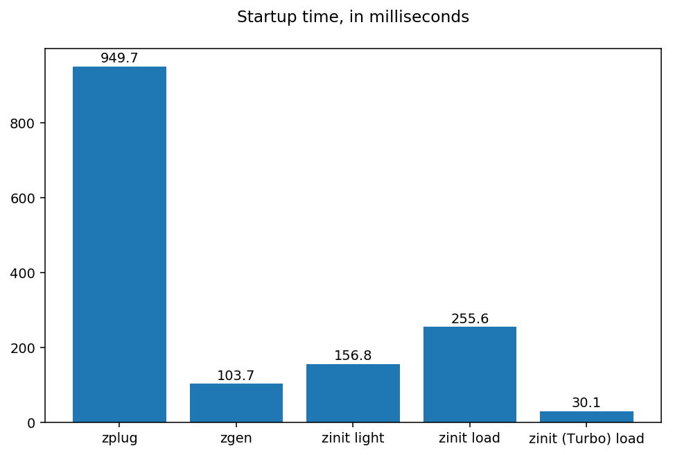

## 前言

最近搞了 Arch WSL，CLI 當然是沒少用，Bash 理所當然的就被我蛋雕了，嘗鮮了一下 Zsh 發現真的很頂，馬上就回不去了，之後有空看看要不要把實驗室的電腦也換成 Zsh 好了。這篇文章應該會不定期更新，如果以後有修改配置或是又玩了什麼新東西的話～

## 美化

我這裡選擇了 [Oh My Posh](https://ohmyposh.dev/) 來美化 Zsh，一來是它在很多 CLI 中都可以使用，二來因為我是用 WSL，主題直接拿裝在 Windows 來用，非常方便，我研究了一陣子，看到很多人使用 [Oh My Zsh](https://ohmyz.sh/)，但我覺得我暫時還不會用到太多的功能，用這種集成的工具就太多了，還是比較喜歡就只拿需要的部分，所以後面插件的管理我也會選用其他的管理工具來幫助我。

至於如何用 Oh My Posh 來美化 Zsh，我想[文檔](https://ohmyposh.dev/docs)已經寫得很清楚了，基本上都是指令貼一貼就搞定，所以我這裡只講一下配置的重點。

安裝完後 Oh My Posh 可能會出現要你把 `/home/{user}/.local/bin` 加到環境變數，這個要特別注意，這行一定要在 Oh My Posh 的 init 指令前面，否則下次進 Zsh 就會回到光溜溜的狀態 ww

這個在前：

```bash
export PATH=$PATH:/home/<user>/.local/bin
```

這個在後：

```bash
eval "$(oh-my-posh init zsh --config <config_json_file_path>)"
```

:::tip[WSL 小技巧]

1. [Nerd Fonts](https://www.nerdfonts.com/) 要裝在 Windows 上，不是裝在 WSL 裡。
2. 本地的 C 槽就是 `/mnt/c`，D 槽就是 `/mnt/d`，以此類推，如果你跟我一樣要直接用放在 Windows 上的主題，路徑要改成這樣。
   :::

## 插件及工具

### Completion

這個部分是設定自動完成有關的，第一行 `zstyle ':completion:*' menu yes select` 是讓我們可以用方向鍵控制選單的選擇，而 `bindkey '^[[Z' reverse-menu-complete` 是讓 <kbd>Shift</kbd> + <kbd>Tab</kbd> 可以切換到上一個選項，換句話說，<kbd>Tab</kbd>是往下，<kbd>Shift</kbd> + <kbd>Tab</kbd> 是往上。不過我後來裝了 `fzf-tab` 後就覆蓋掉本來的選單了，所以我這裡就先註解掉。

```bash
zstyle ':completion:*' menu yes select
bindkey '^[[Z' reverse-menu-complete
```

### fzf scripts

fzf 跟其他插件不太一樣，所以我這裡是直接用 `pacman` 來管理，可以自己換成你使用的套件管理工具：

```bash
sudo pacman -S fzf
```

這裡載入了 fzf 的一些腳本，可以在 fzf 中使用快捷鍵和自動補全，比如 <kbd>Ctrl</kbd> + <kbd>R</kbd> 可以搜尋前面輸入的字串，<kbd>Ctrl</kbd> + <kbd>T</kbd> 可以切換到上一個搜尋結果，<kbd>Ctrl</kbd> + <kbd>G</kbd> 可以切換到下一個搜尋結果，以及其他的指令。

```bash
source /usr/share/fzf/key-bindings.zsh
source /usr/share/fzf/completion.zsh
```

### zinit

最後是 [zinit](https://github.com/zdharma-continuum/zinit) 的設定，zinit 是一個很好用的 Zsh 插件管理工具，可以自動安裝插件，並且可以在切換 Zsh 之間快速切換插件。我會看上它是因為這張表，不過畢竟我也剛入坑，就選了一個看起來簡單好設置，又挺輕量的管理工具來用了。



目前我裝了這些插件，大都蠻常見的：

- [fzf-tab](https://github.com/Aloxaf/fzf-tab): 為 Zsh 的補全功能提供模糊搜尋選項，方便快速選取。
- [zsh-syntax-highlighting](https://github.com/zsh-users/zsh-syntax-highlighting): 讓 Zsh 的指令及腳本文件高亮顯示，方便閱讀。
- [zsh-autosuggestions](https://github.com/zsh-users/zsh-autosuggestions): 自動填入命令行中的參數，提升命令執行效率。
- [zsh-completions](https://github.com/zsh-users/zsh-completions): 提供大量的 Zsh 補全功能，包括 git 和 npm 的補全。
- [zsh-history-substring-search](https://github.com/zsh-users/zsh-history-substring-search): 提供快速搜尋前面輸入的字串的功能，方便快速查找指令。
- [zsh-z](https://github.com/agkozak/zsh-z): 提供 Zsh 的 z 指令，方便快速切換到不同的 Zsh 上下文。

```bash
zinit light Aloxaf/fzf-tab
zinit light zsh-users/zsh-syntax-highlighting
zinit light zsh-users/zsh-autosuggestions
zinit light zsh-users/zsh-completions
zinit light zsh-users/zsh-history-substring-search
zinit light agkozak/zsh-z
```

### 加載和初始化命令補全

```bash
autoload -Uz compinit
compinit
```

## 完整 Zsh 設定檔（.zshrc）

:::note
有些硬編碼的路徑請換成自己的，還有自動生成的部分最好不要自己亂改，除非你知道自己在幹什麼。
:::

```bash
# Lines configured by zsh-newuser-install
HISTFILE=~/.histfile
HISTSIZE=1000
SAVEHIST=1000
bindkey -v
# End of lines configured by zsh-newuser-install

# The following lines were added by compinstall
zstyle :compinstall filename '/home/yuuzi261/.zshrc'
zstyle ':completion:*:descriptions' format '[%d]'
zstyle ':completion:*' list-colors ${(s.:.)LS_COLORS}
# End of lines added by compinstall

### Environmental Variables ###
export PATH=$PATH:/home/yuuzi261/.local/bin     # oh my posh

# >>> conda initialize >>>
# !! Contents within this block are managed by 'conda init' !!
__conda_setup="$('/home/yuuzi261/miniconda3/bin/conda' 'shell.zsh' 'hook' 2> /dev/null)"
if [ $? -eq 0 ]; then
    eval "$__conda_setup"
else
    if [ -f "/home/yuuzi261/miniconda3/etc/profile.d/conda.sh" ]; then
        . "/home/yuuzi261/miniconda3/etc/profile.d/conda.sh"
    else
        export PATH="/home/yuuzi261/miniconda3/bin:$PATH"
    fi
fi
unset __conda_setup
# <<< conda initialize <<<
### END of Environmental Variables ###

# oh my posh init
eval "$(oh-my-posh init zsh --config /mnt/c/Users/Yuuzi/AppData/Local/Programs/oh-my-posh/themes/catppuccin_mocha_enhancement.omp.json)"

# Completion
# zstyle ':completion:*' menu yes select
# bindkey '^[[Z' reverse-menu-complete

# fzf scripts
source /usr/share/fzf/key-bindings.zsh
source /usr/share/fzf/completion.zsh

### Added by Zinit's installer
if [[ ! -f $HOME/.local/share/zinit/zinit.git/zinit.zsh ]]; then
    print -P "%F{33} %F{220}Installing %F{33}ZDHARMA-CONTINUUM%F{220} Initiative Plugin Manager (%F{33}zdharma-continuum/zinit%F{220})…%f"
    command mkdir -p "$HOME/.local/share/zinit" && command chmod g-rwX "$HOME/.local/share/zinit"
    command git clone https://github.com/zdharma-continuum/zinit "$HOME/.local/share/zinit/zinit.git" && \
        print -P "%F{33} %F{34}Installation successful.%f%b" || \
        print -P "%F{160} The clone has failed.%f%b"
fi

source "$HOME/.local/share/zinit/zinit.git/zinit.zsh"
autoload -Uz _zinit
(( ${+_comps} )) && _comps[zinit]=_zinit

# Load a few important annexes, without Turbo
# (this is currently required for annexes)
zinit light-mode for \
    zdharma-continuum/zinit-annex-as-monitor \
    zdharma-continuum/zinit-annex-bin-gem-node \
    zdharma-continuum/zinit-annex-patch-dl \
    zdharma-continuum/zinit-annex-rust

### End of Zinit's installer chunk

### zinit plug ###
zinit light Aloxaf/fzf-tab
zinit light zsh-users/zsh-syntax-highlighting
zinit light zsh-users/zsh-autosuggestions
zinit light zsh-users/zsh-completions
zinit light zsh-users/zsh-history-substring-search
zinit light agkozak/zsh-z
### end zinit plug ###

# Initialize compinit
autoload -Uz compinit
compinit
```
